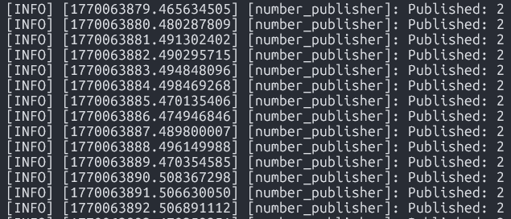
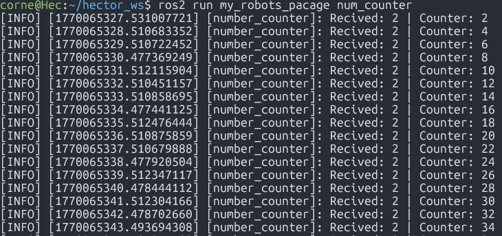
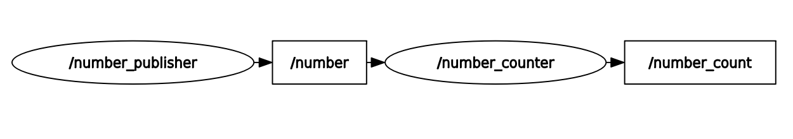

# ROS2 Publisher–Subscriber: Number Accumulator

> Activity:
>Implement two ROS 2 nodes using Python. The first node publishes a constant number periodically. The second node subscribes to that number, accumulates it, and publishes the result.

---
## System Overview
The system is composed of two ROS2 nodes connected through topics:  
- **Number publisher:** Publishes a constant integer value to the **/number** topic.  
- **Number counter:** Subscribes to **/number**, accumulates the received values, and publishes the accumulated result to **/number_count**.  
The data flow can be summarized as:
```bash
(number_publisher) → /number → (number_counter) → /number_count

```

---
## Important concepts
**What is a ROS 2 node?**  
A node is an independent process that performs computation. Nodes can:
- **Publish messages**
- **Subscribe to messages**
- **Maintain internal satate**  
In this system, each node has a specific responsability.

**What is a topic?**  
A topic is a **named communication channel** used to exchange messages between nodes asynchronously.

---
## 1) Number Publisher Node
**Objective**  
The purpose of the **number_publisher** node is to periodically publish a fixed integer value to the **/number** topic.


This node only acts as a data source.  
- Initializes a publisher on **/number**
- Uses a timer to publish every 1 second
- Always publishes the same value **(2)**


**Code**  
```bash
import rclpy
from rclpy.node import Node
from example_interfaces.msg import Int64

# Node that publishes a constant number periodically
class numPublisher(Node):
    def __init__(self):
        # Initialize the node with a unique name
        super().__init__("number_publisher")

        # Create a publisher on the /number topic with Int64 messages
        self.publisher_ = self.create_publisher(Int64, "/number", 10)

        # Create a timer that calls the number() method every 1 second
        self.create_timer(1.0, self.number)

        # Constant value to be published
        self.number = 2

        # Log node startup
        self.get_logger().info("Sending number")

    def number(self):
        # Create a hole numerical value as message
        msg = Int64()

        # Assign the constant number to the message
        msg.data = self.number

        # Publish the message
        self.publisher_.publish(msg)

        # Log the published value
        self.get_logger().info(f"Published: {msg.data}")

def main(args=None):
    # Initialize the ROS 2 Python client library
    rclpy.init(args=args)

    # Create the publisher node
    my_publisher_node = numPublisher()

    # Keep the node running
    rclpy.spin(my_publisher_node)

    # Shutdown ROS 2
    rclpy.shutdown()

if __name__ == "__main__":
    main()


```  


---
## 2) Number Counter Node
**Objective**  
The **number_counter** node receives numbers from **/number**, accumulates them, and publishes the running total to **/number_count**. This node functions both as a subscriber to my **Number Publisher Node** and as a publisher.


**Node Behavior**  
- Subscribes to **/number**
- Starts a counter using the recived nombar and adding 2 with each iteration
- Publishes the updated counter immediately after receiving a message

**Code**  
```bash
#!/usr/bin/env python3

import rclpy
from rclpy.node import Node
from example_interfaces.msg import Int64

# Node that subscribes to /number, accumulates the values,
# and publishes the result on /number_count
class numCounter(Node):
    def __init__(self):
        # Initialize the node with a unique name
        super().__init__("number_counter")

        # Internal counter variable
        self.counter = 0

        # Subscribe to the /number topic
        self.subscriber = self.create_subscription(
            Int64,
            "/number",
            self.callback_receive_info,
            10
        )

        # Publisher for the accumulated value
        self.publisher = self.create_publisher(
            Int64,
            "/number_count",
            10
        )

    def callback_receive_info(self, msg: Int64):
        # Add the received number to the counter
        self.counter += msg.data

        # Create a message with the updated counter value
        out_msg = Int64()
        out_msg.data = self.counter

        # Publish the updated counter
        self.publisher.publish(out_msg)

        # Log received and accumulated values
        self.get_logger().info(
            f"Received: {msg.data} | Counter: {self.counter}"
        )

def main(args=None):
    # Initialize the ROS 2 Python client library
    rclpy.init(args=args)

    # Create the counter node
    counter_node = numCounter()

    # Keep the node running
    rclpy.spin(counter_node)

    # Shutdown ROS 2
    rclpy.shutdown()

if __name__ == "__main__":
    main()

```

---
## Results
**Number Publisher Node**


**Number Counter Node**


**Graph of the nodes realtion**

