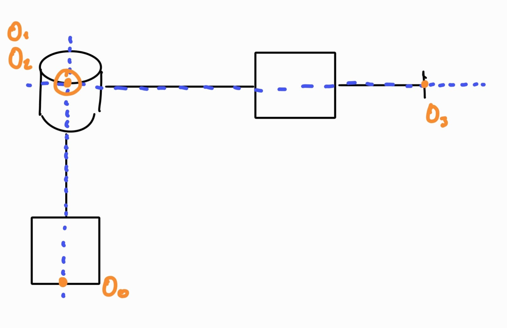
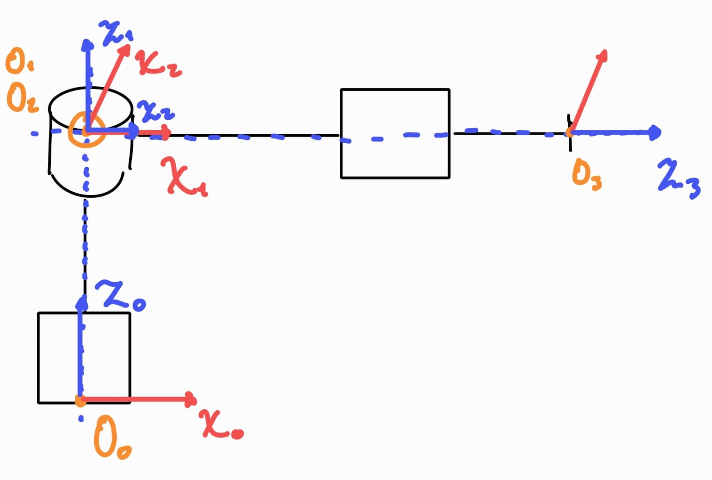
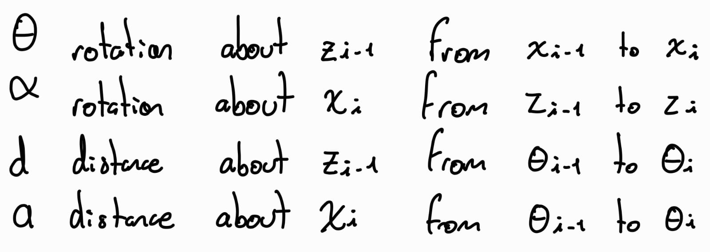
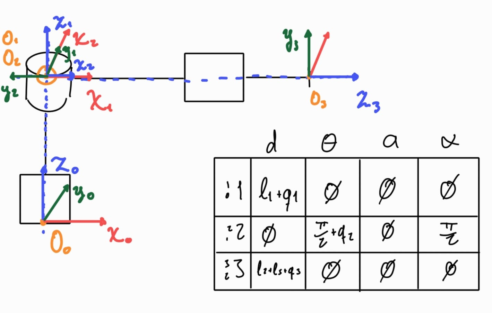
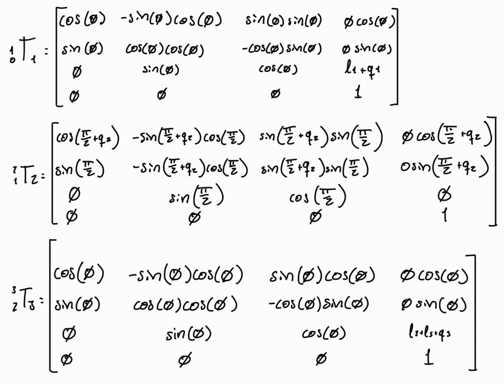

# Forward Kinematics

> Get the matrix and DH placement of the frames, for the following robots

---

## Important concepts
**What are forward Kinematics?**  
It refers to the study of motion, without considering forces, of a robot to calculate its final position and orientation of its end-effector, which refers to its last joint where a tool may be attached.

**How to obtain the forward kinematics of a robot?**
### Step 1: Establish the Z axis of each joint.  
This depends mainly on the type of joint, the most used are the prismatic joint and the revolute joint. Those are the ones used in the following cases, therefore I’m only focusing on them.  

- For a **Prismatic joint**, the Z axis is oriented along the joint linear displacement. This means that the Z axis will follow along in the direction between the **Link** of the interested **joint i-1** unto the next **joint i.**
- For a **revolute joint**, the Z axis is oriented along the angle of rotation. This means that the Z axis is the line in which the revolute joint turns about.

### Step 2: Establish the origins of each joint.  
Take the following sistem as an example:

As shown in the previous example, the first step is to define the **Z-axis of each joint**, which is chosen according to the type of joint and the direction of its motion. The origin of frame i is placed at the intersection of the Z-axis of the previous joint (Z _i-1_) and the Z-axis of the current joint (Z _i_).  

For the first joint, the origin can be placed arbitrarily, since there is no previous Z-axis to intersect with. However, **it is recommended to place the origin at the base of the joint**, as this simplifies the model and avoids the need to introduce additional measurements to account for offsets. If at any point the axes Z _i-1_ and Z _i_ do not intersect, the origin may be placed anywhere along the Z-axis of the current joint, considering it as an infinite line.

### Step 3: Establish the X axis for each joint.  
The **X-axis** is placed orthogonally to both Z i-1 and Z i. This means that the X-axis forms a 90-degree angle with each of these Z-axes.

### Step 4: Establish the Y axis for each joint.
To obtain the **transformation matrix** for each joint, the Y-axis is not explicitly used. However, it is still good practice to define it in order to complete the reference frame of each joint. The Y-axis is defined according to the right-hand rule, so once the X- and Z-axes are established, the Y-axis is automatically determined.

### Step 5: The Denavit-Hartenberg Convention.  
A commonly used convention to select frames of reference in robotics is the Denavit-Hartenberg Convention. In this convention each homogeneous transformation matrix can be represented as the product of four basic transformations.

<math xmlns="http://www.w3.org/1998/Math/MathML" display="block">
  <msub>
    <mi>T</mi>
    <mi>i</mi>
  </msub>
  <mo>=</mo>
  <msub>
    <mi>R</mi>
    <mi>z</mi>
  </msub>
  <mo stretchy="false">(</mo>
  <msub>
    <mi>&#x3B8;</mi>
    <mi>i</mi>
  </msub>
  <mo stretchy="false">)</mo>
  <msub>
    <mi>t</mi>
    <mi>z</mi>
  </msub>
  <mo stretchy="false">(</mo>
  <msub>
    <mi>d</mi>
    <mi>i</mi>
  </msub>
  <mo stretchy="false">)</mo>
  <msub>
    <mi>t</mi>
    <mi>x</mi>
  </msub>
  <mo stretchy="false">(</mo>
  <msub>
    <mi>a</mi>
    <mi>i</mi>
  </msub>
  <mo stretchy="false">)</mo>
  <msub>
    <mi>R</mi>
    <mi>x</mi>
  </msub>
  <mo stretchy="false">(</mo>
  <msub>
    <mi>&#x3B1;</mi>
    <mi>i</mi>
  </msub>
  <mo stretchy="false">)</mo>
</math>

Where:

If we expand the transformation matrix T:
<math xmlns="http://www.w3.org/1998/Math/MathML" display="block">
  <msub>
    <mi>T</mi>
    <mi>i</mi>
  </msub>
  <mo>=</mo>
  <mrow data-mjx-texclass="INNER">
    <mo data-mjx-texclass="OPEN">[</mo>
    <mtable columnspacing="1em" rowspacing="4pt">
      <mtr>
        <mtd>
          <mi>cos</mi>
          <mo data-mjx-texclass="NONE">&#x2061;</mo>
          <msub>
            <mi>&#x3B8;</mi>
            <mi>i</mi>
          </msub>
        </mtd>
        <mtd>
          <mo>&#x2212;</mo>
          <mi>sin</mi>
          <mo data-mjx-texclass="NONE">&#x2061;</mo>
          <msub>
            <mi>&#x3B8;</mi>
            <mi>i</mi>
          </msub>
        </mtd>
        <mtd>
          <mn>0</mn>
        </mtd>
        <mtd>
          <mn>0</mn>
        </mtd>
      </mtr>
      <mtr>
        <mtd>
          <mi>sin</mi>
          <mo data-mjx-texclass="NONE">&#x2061;</mo>
          <msub>
            <mi>&#x3B8;</mi>
            <mi>i</mi>
          </msub>
        </mtd>
        <mtd>
          <mi>cos</mi>
          <mo data-mjx-texclass="NONE">&#x2061;</mo>
          <msub>
            <mi>&#x3B8;</mi>
            <mi>i</mi>
          </msub>
        </mtd>
        <mtd>
          <mn>0</mn>
        </mtd>
        <mtd>
          <mn>0</mn>
        </mtd>
      </mtr>
      <mtr>
        <mtd>
          <mn>0</mn>
        </mtd>
        <mtd>
          <mn>0</mn>
        </mtd>
        <mtd>
          <mn>1</mn>
        </mtd>
        <mtd>
          <mn>0</mn>
        </mtd>
      </mtr>
      <mtr>
        <mtd>
          <mn>0</mn>
        </mtd>
        <mtd>
          <mn>0</mn>
        </mtd>
        <mtd>
          <mn>0</mn>
        </mtd>
        <mtd>
          <mn>1</mn>
        </mtd>
      </mtr>
    </mtable>
    <mo data-mjx-texclass="CLOSE">]</mo>
  </mrow>
  <mrow data-mjx-texclass="INNER">
    <mo data-mjx-texclass="OPEN">[</mo>
    <mtable columnspacing="1em" rowspacing="4pt">
      <mtr>
        <mtd>
          <mn>1</mn>
        </mtd>
        <mtd>
          <mn>0</mn>
        </mtd>
        <mtd>
          <mn>0</mn>
        </mtd>
        <mtd>
          <mn>0</mn>
        </mtd>
      </mtr>
      <mtr>
        <mtd>
          <mn>0</mn>
        </mtd>
        <mtd>
          <mn>1</mn>
        </mtd>
        <mtd>
          <mn>0</mn>
        </mtd>
        <mtd>
          <mn>0</mn>
        </mtd>
      </mtr>
      <mtr>
        <mtd>
          <mn>0</mn>
        </mtd>
        <mtd>
          <mn>0</mn>
        </mtd>
        <mtd>
          <mn>1</mn>
        </mtd>
        <mtd>
          <msub>
            <mi>d</mi>
            <mi>i</mi>
          </msub>
        </mtd>
      </mtr>
      <mtr>
        <mtd>
          <mn>0</mn>
        </mtd>
        <mtd>
          <mn>0</mn>
        </mtd>
        <mtd>
          <mn>0</mn>
        </mtd>
        <mtd>
          <mn>1</mn>
        </mtd>
      </mtr>
    </mtable>
    <mo data-mjx-texclass="CLOSE">]</mo>
  </mrow>
  <mrow data-mjx-texclass="INNER">
    <mo data-mjx-texclass="OPEN">[</mo>
    <mtable columnspacing="1em" rowspacing="4pt">
      <mtr>
        <mtd>
          <mn>1</mn>
        </mtd>
        <mtd>
          <mn>0</mn>
        </mtd>
        <mtd>
          <mn>0</mn>
        </mtd>
        <mtd>
          <msub>
            <mi>a</mi>
            <mi>i</mi>
          </msub>
        </mtd>
      </mtr>
      <mtr>
        <mtd>
          <mn>0</mn>
        </mtd>
        <mtd>
          <mn>1</mn>
        </mtd>
        <mtd>
          <mn>0</mn>
        </mtd>
        <mtd>
          <mn>0</mn>
        </mtd>
      </mtr>
      <mtr>
        <mtd>
          <mn>0</mn>
        </mtd>
        <mtd>
          <mn>0</mn>
        </mtd>
        <mtd>
          <mn>1</mn>
        </mtd>
        <mtd>
          <mn>0</mn>
        </mtd>
      </mtr>
      <mtr>
        <mtd>
          <mn>0</mn>
        </mtd>
        <mtd>
          <mn>0</mn>
        </mtd>
        <mtd>
          <mn>0</mn>
        </mtd>
        <mtd>
          <mn>1</mn>
        </mtd>
      </mtr>
    </mtable>
    <mo data-mjx-texclass="CLOSE">]</mo>
  </mrow>
  <mrow data-mjx-texclass="INNER">
    <mo data-mjx-texclass="OPEN">[</mo>
    <mtable columnspacing="1em" rowspacing="4pt">
      <mtr>
        <mtd>
          <mn>1</mn>
        </mtd>
        <mtd>
          <mn>0</mn>
        </mtd>
        <mtd>
          <mn>0</mn>
        </mtd>
        <mtd>
          <mn>0</mn>
        </mtd>
      </mtr>
      <mtr>
        <mtd>
          <mn>0</mn>
        </mtd>
        <mtd>
          <mi>cos</mi>
          <mo data-mjx-texclass="NONE">&#x2061;</mo>
          <msub>
            <mi>&#x3B1;</mi>
            <mi>i</mi>
          </msub>
        </mtd>
        <mtd>
          <mo>&#x2212;</mo>
          <mi>sin</mi>
          <mo data-mjx-texclass="NONE">&#x2061;</mo>
          <msub>
            <mi>&#x3B1;</mi>
            <mi>i</mi>
          </msub>
        </mtd>
        <mtd>
          <mn>0</mn>
        </mtd>
      </mtr>
      <mtr>
        <mtd>
          <mn>0</mn>
        </mtd>
        <mtd>
          <mi>sin</mi>
          <mo data-mjx-texclass="NONE">&#x2061;</mo>
          <msub>
            <mi>&#x3B1;</mi>
            <mi>i</mi>
          </msub>
        </mtd>
        <mtd>
          <mi>cos</mi>
          <mo data-mjx-texclass="NONE">&#x2061;</mo>
          <msub>
            <mi>&#x3B1;</mi>
            <mi>i</mi>
          </msub>
        </mtd>
        <mtd>
          <mn>0</mn>
        </mtd>
      </mtr>
      <mtr>
        <mtd>
          <mn>0</mn>
        </mtd>
        <mtd>
          <mn>0</mn>
        </mtd>
        <mtd>
          <mn>0</mn>
        </mtd>
        <mtd>
          <mn>1</mn>
        </mtd>
      </mtr>
    </mtable>
    <mo data-mjx-texclass="CLOSE">]</mo>
  </mrow>
</math>

Which simplifies to:
<math xmlns="http://www.w3.org/1998/Math/MathML" display="block">
  <msub>
    <mi>T</mi>
    <mi>i</mi>
  </msub>
  <mo>=</mo>
  <mrow data-mjx-texclass="INNER">
    <mo data-mjx-texclass="OPEN">[</mo>
    <mtable columnspacing="1em" rowspacing="4pt">
      <mtr>
        <mtd>
          <mi>cos</mi>
          <mo data-mjx-texclass="NONE">&#x2061;</mo>
          <msub>
            <mi>&#x3B8;</mi>
            <mi>i</mi>
          </msub>
        </mtd>
        <mtd>
          <mo>&#x2212;</mo>
          <mi>sin</mi>
          <mo data-mjx-texclass="NONE">&#x2061;</mo>
          <msub>
            <mi>&#x3B8;</mi>
            <mi>i</mi>
          </msub>
          <mi>cos</mi>
          <mo data-mjx-texclass="NONE">&#x2061;</mo>
          <msub>
            <mi>&#x3B1;</mi>
            <mi>i</mi>
          </msub>
        </mtd>
        <mtd>
          <mi>sin</mi>
          <mo data-mjx-texclass="NONE">&#x2061;</mo>
          <msub>
            <mi>&#x3B8;</mi>
            <mi>i</mi>
          </msub>
          <mi>sin</mi>
          <mo data-mjx-texclass="NONE">&#x2061;</mo>
          <msub>
            <mi>&#x3B1;</mi>
            <mi>i</mi>
          </msub>
        </mtd>
        <mtd>
          <msub>
            <mi>a</mi>
            <mi>i</mi>
          </msub>
          <mi>cos</mi>
          <mo data-mjx-texclass="NONE">&#x2061;</mo>
          <msub>
            <mi>&#x3B8;</mi>
            <mi>i</mi>
          </msub>
        </mtd>
      </mtr>
      <mtr>
        <mtd>
          <mi>sin</mi>
          <mo data-mjx-texclass="NONE">&#x2061;</mo>
          <msub>
            <mi>&#x3B8;</mi>
            <mi>i</mi>
          </msub>
        </mtd>
        <mtd>
          <mi>cos</mi>
          <mo data-mjx-texclass="NONE">&#x2061;</mo>
          <msub>
            <mi>&#x3B8;</mi>
            <mi>i</mi>
          </msub>
          <mi>cos</mi>
          <mo data-mjx-texclass="NONE">&#x2061;</mo>
          <msub>
            <mi>&#x3B1;</mi>
            <mi>i</mi>
          </msub>
        </mtd>
        <mtd>
          <mo>&#x2212;</mo>
          <mi>cos</mi>
          <mo data-mjx-texclass="NONE">&#x2061;</mo>
          <msub>
            <mi>&#x3B8;</mi>
            <mi>i</mi>
          </msub>
          <mi>sin</mi>
          <mo data-mjx-texclass="NONE">&#x2061;</mo>
          <msub>
            <mi>&#x3B1;</mi>
            <mi>i</mi>
          </msub>
        </mtd>
        <mtd>
          <msub>
            <mi>a</mi>
            <mi>i</mi>
          </msub>
          <mi>sin</mi>
          <mo data-mjx-texclass="NONE">&#x2061;</mo>
          <msub>
            <mi>&#x3B8;</mi>
            <mi>i</mi>
          </msub>
        </mtd>
      </mtr>
      <mtr>
        <mtd>
          <mn>0</mn>
        </mtd>
        <mtd>
          <mi>sin</mi>
          <mo data-mjx-texclass="NONE">&#x2061;</mo>
          <msub>
            <mi>&#x3B1;</mi>
            <mi>i</mi>
          </msub>
        </mtd>
        <mtd>
          <mi>cos</mi>
          <mo data-mjx-texclass="NONE">&#x2061;</mo>
          <msub>
            <mi>&#x3B1;</mi>
            <mi>i</mi>
          </msub>
        </mtd>
        <mtd>
          <msub>
            <mi>d</mi>
            <mi>i</mi>
          </msub>
        </mtd>
      </mtr>
      <mtr>
        <mtd>
          <mn>0</mn>
        </mtd>
        <mtd>
          <mn>0</mn>
        </mtd>
        <mtd>
          <mn>0</mn>
        </mtd>
        <mtd>
          <mn>1</mn>
        </mtd>
      </mtr>
    </mtable>
    <mo data-mjx-texclass="CLOSE">]</mo>
  </mrow>
</math>

Whit this information we can creat a list with all of the D-H parameters and replace those values in the matrix for each joint.

### Step 6: Multiply all the transformation matrices  
Obtain the overall transformation of the robot, from the base to its end factor, by multiplying the individual transformation matirces:  

<math xmlns="http://www.w3.org/1998/Math/MathML" display="block">
  <msubsup>
    <mrow data-mjx-texclass="ORD"></mrow>
    <mrow data-mjx-texclass="ORD">
      <mi>n</mi>
    </mrow>
    <mrow data-mjx-texclass="ORD">
      <mn>0</mn>
    </mrow>
  </msubsup>
  <mrow data-mjx-texclass="ORD">
    <mi mathvariant="bold">T</mi>
  </mrow>
  <mo>=</mo>
  <msubsup>
    <mrow data-mjx-texclass="ORD"></mrow>
    <mrow data-mjx-texclass="ORD">
      <mn>1</mn>
    </mrow>
    <mrow data-mjx-texclass="ORD">
      <mn>0</mn>
    </mrow>
  </msubsup>
  <mrow data-mjx-texclass="ORD">
    <mi mathvariant="bold">T</mi>
  </mrow>
  <mo>&#x22C5;</mo>
  <msubsup>
    <mrow data-mjx-texclass="ORD"></mrow>
    <mrow data-mjx-texclass="ORD">
      <mn>2</mn>
    </mrow>
    <mrow data-mjx-texclass="ORD">
      <mn>1</mn>
    </mrow>
  </msubsup>
  <mrow data-mjx-texclass="ORD">
    <mi mathvariant="bold">T</mi>
  </mrow>
  <mo>&#x22C5;</mo>
  <mo>&#x2026;</mo>
  <mo>&#x22C5;</mo>
  <msubsup>
    <mrow data-mjx-texclass="ORD"></mrow>
    <mrow data-mjx-texclass="ORD">
      <mi>n</mi>
    </mrow>
    <mrow data-mjx-texclass="ORD">
      <mi>n</mi>
      <mo>&#x2212;</mo>
      <mn>1</mn>
    </mrow>
  </msubsup>
  <mrow data-mjx-texclass="ORD">
    <mi mathvariant="bold">T</mi>
  </mrow>
</math>