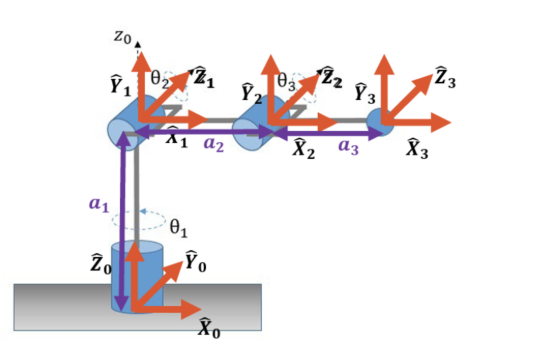
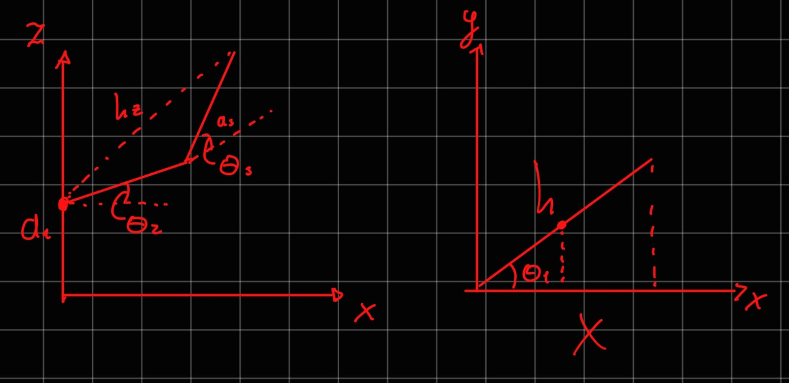
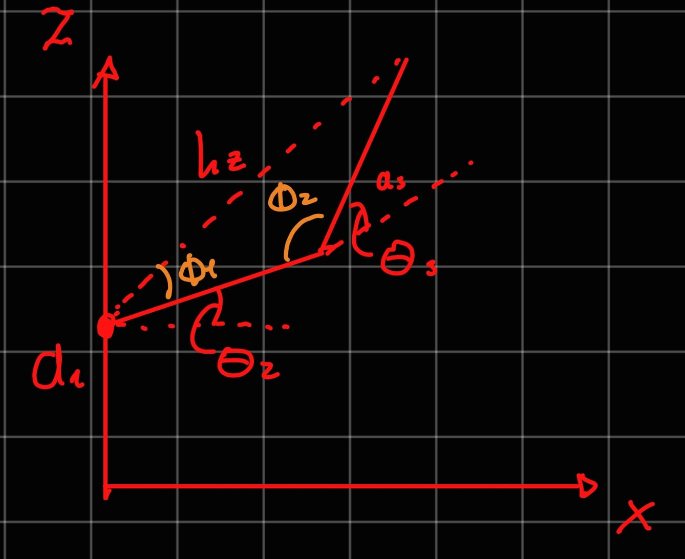
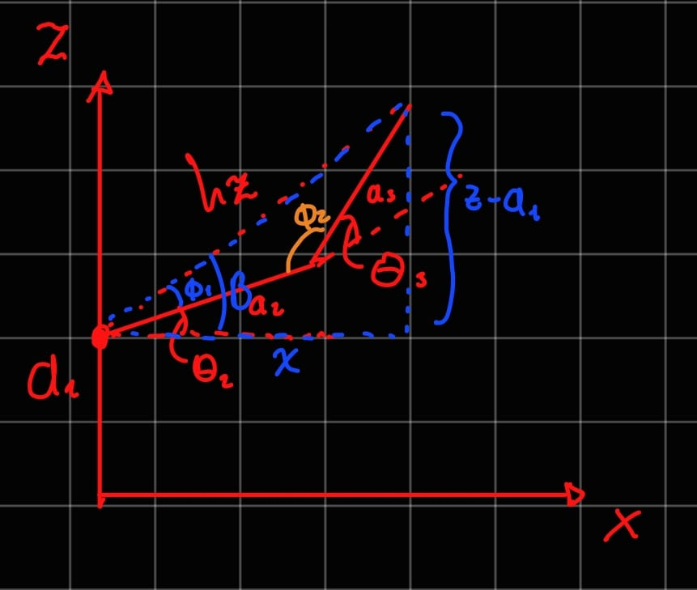
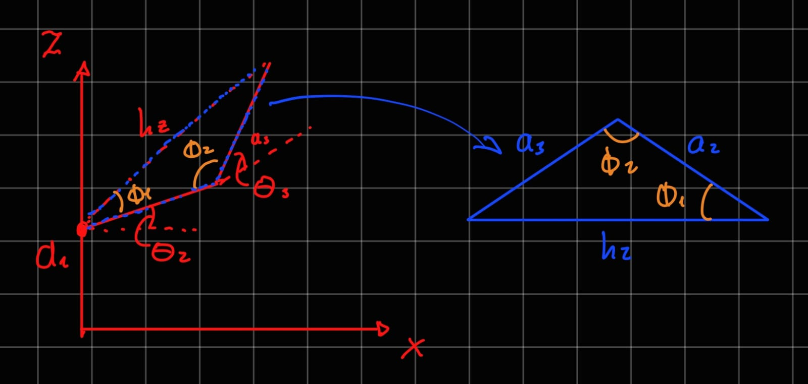
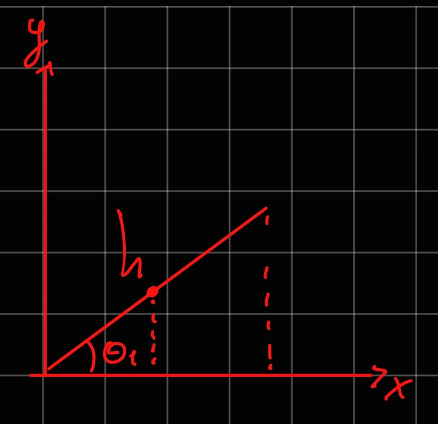

# Inverse Kinematics
> Activity: For the following robot, get the IK via the geometirc method and calculate it's jacobian. The jacobian via algebraic or geometric method.

---

## Solving the IK via the geometric method
In this case, we have a 3 DOF robot with 3 revolute joints. We can solve the IK by using the geometric method, which involves breaking down the problem into simpler subproblems and using trigonometry to find the joint angles.



1. **Analize the robot's structure**: We can see that the robot has three joints, and we can define the joint angles as θ1, θ2, and θ3. this are our variables to solve for. We can also define some constants such as the lengths of the links (L1, L2, L3). Although the end-effector position (x, y, z) can vary, once we specify a target destination it is treated as fixed or constant. This allows us to solve for the joint angles that achieve that position.

2. **Choose the planes of motion**: To simplify our calculations, we can choose specific planes of motion for each joint. In this case the chosen planes are the XZ plane for the second and third joints, and the XY plane for the first joint. This allows us to decouple the motion of the joints and solve for each joint angle independently.



The XZ plane is chosen for the second and third joints because it allows us to analyze the vertical motion of the robot, while the XY plane is chosen for the first joint to analyze the horizontal motion. By breaking down the problem into these planes, we can use trigonometric relationships to find the joint angles that achieve the desired end-effector position.

**XZ Plane Analysis**



It can be observed that θ2, and θ3 create an obtuse triangle with the end-effector position. We can use the law of cosines to find the angles of this triangle, which will allow us to solve for θ2 and θ3.  
To start the analisis we need the hypotenuse of the triangle, this can be easily calculated by constructing another right triangle, with the end-effector position and the projection of the end-effector on the XZ plane. This looks like this:



By convining the two triangles the foillowing relationships can be established:
B = tan^-1((z-L1)/x)
B = φ1 + θ2
θ2 = B - φ1
θ3 = 180 - φ2
hz = 
``` math
\sqrt{x^2 + (z - L1)^2}
```  
Now knowing the length of the hypotenuse (h) we can apply the law of cosines to find the angles of the obtuse triangle:



a3^2 = a2^2 + h^2 - 2*a2*h*cos(φ1)
h^2 = a2^2 + a3^2 - 2*a2*a3*cos(φ2)
φ1 = cos^-1((a2^2 + h^2 - a3^2) / (2*a2*h))
φ2 = cos^-1((a2^2 + a3^2 - h^2) / (2*a2*a3))

All that is left is to replace the value of those angles in the equations to find θ2 and θ3:  
θ2 = tan^-1((z-L1)/x) - cos^-1((a2^2 + h^2 - a3^2) / (2*a2*h))
θ3 = 180 - cos^-1((a2^2 + a3^2 - h^2) / (2*a2*a3))

**XY Plane Analysis**



In the XY plane, we can analyze the motion of the first joint (θ1). We can use the arctangent function to find θ1 based on the x and y coordinates of the end-effector position. The relationship can be expressed as:
cos(θ1) = x / h
θ1 = tan^-1(x / h)
θ1 = tan^-1(x / sqrt(x^2 + (z - L1)^2))

## Calculating the Jacobian
The Jacobian matrix relates the joint velocities to the end-effector velocities. It can be calculated using either the algebraic method or the geometric method. In this case, we will calculate the Jacobian using the geometric method, which involves taking the partial derivatives of the end-effector position with respect to each joint angle.

**1. DH Parameters**: To calculate the Jacobian, we first need to define the Denavit-Hartenberg (DH) parameters for the robot. The DH parameters are a standardized way of representing the kinematic structure of a robot. For our 3 DOF robot, we can define the DH parameters as follows:

| Link | α (alpha)  | a (link length) | d (link offset) | θ (joint angle) |
|------|------------|-----------------|-----------------|-----------------|
| 1    | -π/2       | 0               | L1              | q1              |
| 2    | 0          | L2              | 0               | q2              |
| 3    | 0          | L3              | 0               | q3              |

**2. Transformation Matrices**: Next, we can calculate the transformation matrices for each joint using the DH parameters. The transformation matrix for each joint can be calculated using the following formula:
T_i = 
\[\begin{bmatrix}
\cos(θ_i) & -\sin(θ_i)\cos(α_i) & \sin(θ_i)\sin(α_i) & a_i\cos(θ_i) \\
\sin(θ_i) & \cos(θ_i)\cos(α_i) & -\cos(θ_i)\sin(α_i) & a_i\sin(θ_i) \\
0 & \sin(α_i) & \cos(α_i) & d_i \\
0 & 0 & 0 & 1  
\end{bmatrix}\]
We can calculate the transformation matrices for each joint and then multiply them together to get the overall transformation from the base to the end-effector.  
T_0_1 = 
\[\begin{bmatrix}
\cos(q1) & 0 & \sin(q1) & 0 \\
\sin(q1) & 0 & -\cos(q1) & 0 \\
0 & -1 & 0 & L1 \\
0 & 0 & 0 & 1
\end{bmatrix}\]  
T_1_2 = 
\[\begin{bmatrix}
\cos(q2) & -\sin(q2) & 0 & L2\cos(q2) \\
\sin(q2) & \cos(q2) & 0 & L2\sin(q2) \\
0 & 0 & 1 & 0 \\
0 & 0 & 0 & 1
\end{bmatrix}\]  
T_2_3 = 
\[\begin{bmatrix}
\cos(q3) & -\sin(q3) & 0 & L3\cos(q3) \\
\sin(q3) & \cos(q3) & 0 & L3\sin(q3) \\
0 & 0 & 1 & 0 \\
0 & 0 & 0 & 1
\end{bmatrix}\]  
T_0_3 = T_0_1 * T_1_2 * T_2_3  
I calculated the T_0_3 matrix in matlab using the following code:
```matlab
>> % Definir variables simbólicas
syms q1 q2 q3 a1 a2 a3 
>> % Matriz A
A = [cos(q1) 0 sin(q1) 0;
     sin(q1) 0 cos(q1) 0;
     0 -1 0 a1;
     0 0 0 1];

% Matriz B
B = [cos(q2) -sin(q2) 0 a2*cos(q2);
     sin(q2)  cos(q2) 0 a2*sin(q2);
     0 0 1 0;
     0 0 0 1];

% Matriz C
C = [cos(q3) -sin(q3) 0 a3*cos(q3);
     sin(q3)  cos(q3) 0 a3*sin(q3);
     0 0 1 0;
     0 0 0 1];
>> % Multiplicación de matrices
T = A * B * C;
>> % Simplificar resultado
T = simplify(T);

>> % Mostrar resultado
disp(T)
[cos(q2 + q3)*cos(q1), -sin(q2 + q3)*cos(q1), sin(q1), cos(q1)*(a3*cos(q2 + q3) + a2*cos(q2))]
[cos(q2 + q3)*sin(q1), -sin(q2 + q3)*sin(q1), cos(q1), sin(q1)*(a3*cos(q2 + q3) + a2*cos(q2))]
[       -sin(q2 + q3),         -cos(q2 + q3),       0,      a1 - a3*sin(q2 + q3) - a2*sin(q2)]
[                   0,                     0,       0,                                      1]
 
```

The resulting transformation matrix T_0_3 gives us the position and orientation of the end-effector in terms of the joint angles q1, q2, and q3. The first three columns of the matrix represent the rotation, while the last column represents the translation (position) of the end-effector. To calculate the Jacobian, we can take the partial derivatives of the end-effector position with respect to each joint angle. The Jacobian matrix J can be expressed as:
J = \[\begin{bmatrix}
\frac{\partial x}{\partial q1} & \frac{\partial x}{\partial q2} & \frac{\partial x}{\partial q3} \\
\frac{\partial y}{\partial q1} & \frac{\partial y}{\partial q2} & \frac{\partial y}{\partial q3} \\
\frac{\partial z}{\partial q1} & \frac{\partial z}{\partial q2} & \frac{\partial z}{\partial q3}
\end{bmatrix}\]
Where x, y, and z are the components of the end-effector position. By calculating these partial derivatives, we can fill in the Jacobian matrix, which will allow us to relate joint velocities to end-effector velocities.
```matlab
>> % Calcular las derivadas parciales
J = jacobian(T(1:3,4), [q1, q2, q3]);
>> % Simplificar el resultado
J = simplify(J);
>> % Mostrar el resultado
disp(J)
[-sin(q1)*(a3*cos(q2 + q3) + a2*cos(q2)), -cos(q1)*(a3*sin(q2 + q3) + a2*sin(q2)), -a3*sin(q2 + q3)*cos(q1)]
[ cos(q1)*(a3*cos(q2 + q3) + a2*cos(q2)), -sin(q1)*(a3*sin(q2 + q3) + a2*sin(q2)), -a3*sin(q2 + q3)*sin(q1)]
[                                      0,          - a3*cos(q2 + q3) - a2*cos(q2),         -a3*cos(q2 + q3)]
```
The resulting Jacobian matrix J relates the joint velocities (q1_dot, q2_dot, q3_dot) to the end-effector velocities (x_dot, y_dot, z_dot) through the equation:
\[\begin{bmatrix}x_dot \\ y_dot \\ z_dot\end{bmatrix} = J \begin{bmatrix}q1_dot \\ q2_dot \\ q3_dot\end{bmatrix}\]
This allows us to understand how changes in the joint angles affect the position of the end-effector, which is crucial for tasks such as motion planning and control in robotics.