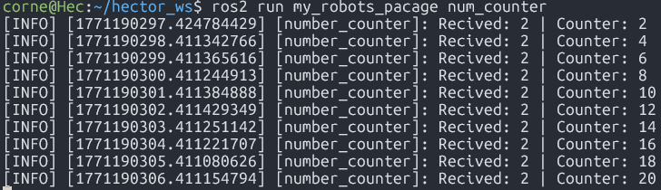
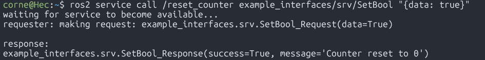

# Ros2 Service Server

> Activity: Using the number_counter node from the "ROS2 Publisher-Subscriber: Number Accumulator" assignment, creat a service that uses boolean values to restar the node counter.

---

**Visit the ROS2 Publisher-Subscriber: Number Accumulator assignment to check the codes in wich I worked upon in this assignment**

## 1)Implementig and undestanding the service interface
The objective is to implement a service server that upon beeing called, will check the (bool data) from the request, then by (bool suceess) it will indicate a succesfull run of trigerred service, finally an informational message will be sent by (string message) to print any inidcation, error, or information that's considered important. All this using the arlready-installed interface:  
``` codigo
example_interfaces/srv/SetBool
```  

Inspect the interface, in the Ubuntu terminal, on your work space, use the following comand:  

``` code
ros2 interface show example_interfaces/srv/SetBool
```

Expected output:

``` code
bool data # e.g. for hardware enabling / disabling
---
bool success   # indicate successful run of triggered service
string message # informational, e.g. for error messages
```

The (---) separates:  
- **Request** (client to server): bool request  
- **Response** (server to client): bool success, string message  

## 2) Server implementation

### Imports
``` code
#!/usr/bin/env python3
import rclpy
from rclpy.node import Node
from example_interfaces.msg import Int64 
from example_interfaces.srv import SetBool
```  
**What does it do?**  
- Service live under ...srv  
- SetBool contains both:  
    - bool request (data)  
    - bool response (successm, string message)   

**Important**
Add **example_interface** to the __package.xml__ file like so:  

``` code
<?xml version="1.0"?>
<?xml-model href="http://download.ros.org/schema/package_format3.xsd" schematypens="http://www.w3.org/2001/XMLSchema"?>
<package format="3">
  <name>my_robots_pacage</name>
  <version>0.0.0</version>
  <description>TODO: Package description</description>
  <maintainer email="corne@todo.todo">corne</maintainer>
  <license>TODO: License declaration</license>

  <depend>rclpy</depend>
  <depend>example_interfaces</depend>

  <test_depend>ament_copyright</test_depend>
  <test_depend>ament_flake8</test_depend>
  <test_depend>ament_pep257</test_depend>
  <test_depend>python3-pytest</test_depend>

  <export>
    <build_type>ament_python</build_type>
  </export>
</package>
```

---

### Define the node class and constructor
``` code
class numCounter(Node):
    def __init__(self):
        #Initialize node with the name "number_counter"
        super().__init__("number_counter")
```  
**What does it do?**  
- Creates a node class called: **numCounter**  
- Sets the node name to: **number_counter**  

---

### Create the service server, starts the counter on 0
``` code
        self.server_ = self.create_service(SetBool, "/reset_counter",self.read_bool_callback) # Creats a service server type SetBool. It needs: (Service type, service name, callback function)
        self.counter = 0 # Start the counter on 0
```  
**What does it do?**  
- Creates the server with it's type: **SetBool**, service name: **/reset_counter**, callback function: **self.read_bool_callback**  
- Starts the counter on 0  

---

### Create the service callback function
``` code
# Service callback for /reset_counter
    def read_bool_callback(self, request, response):
        # Boolean condition if request.data is true, reset the counter to 0.
        if request.data:
            # reset counter
            self.counter = 0;
            #Indicates succesful reset
            response.success = True
            response.message = "Counter reset to 0"
            # Log reset event
            self.get_logger().info("Counter restarted to 0")
        else:
            # No reset performed
            response.success = False
            response.message = "Counter not reset"
        return response
```  
**What does it do?**  
- Starts the service callback for /reset_counter  
- Calls the boolean value: **request.data**; If true, resets the counter to 0  
- Indicates succesful reset: **response.success = True**. **response.message = "Counter reset to 0"**  
- Log info for counter reset event: **self.get_logger().info("Counter restarted to 0")**  
- In case the boolean value: **request.data** is false, nothing happens  
- Indicates the reset not performed: **response.success = False**, **response.message = "Counter not reset"**  

---

## 3) Full code (the number_counter code with the server modifications)
``` code
#!/usr/bin/env python3
import rclpy
from rclpy.node import Node
from example_interfaces.msg import Int64 
from example_interfaces.srv import SetBool

class numCounter(Node):
    def __init__(self):
        #Initialize node with the name "number_counter"
        super().__init__("number_counter")
        self.server_ = self.create_service(SetBool, "/reset_counter",self.read_bool_callback) # Creats a service server type SetBool. It needs: (Service type, service name, callback function)
        self.counter = 0 # Start the counter on 0
        self.subscriber = self.create_subscription(Int64,"/number", self.callback_receive_info,10) # (Type, topic name, callback function, queue size)
        self.publisher = self.create_publisher(Int64,"/number_count",10) # (Type, topic name, queue size)

    #Subscriber callback. Triggers every time a message is received on /number. Adds the received value to the internal counter and publishes the updated total.
    def callback_receive_info(self, msg: Int64): #its receiving a msg of type String
        # Acumulate recived value
        self.counter += msg.data
        # Create message to publish
        out_msg = Int64()
        out_msg.data = self.counter
        #Log received value and current counter state
        self.get_logger().info(f"Recived: {msg.data} | Counter: {self.counter}") #print the data field
        #Published updated counter value
        self.publisher.publish(out_msg)

    # Service callback for /reset_counter. If request.data is true, reset the counter to 0.
    def read_bool_callback(self, request, response):
        # Boolean condition
        if request.data:
            # reset counter
            self.counter = 0;
            #Indicates succesful reset
            response.success = True
            response.message = "Counter reset to 0"
            # Log reset event
            self.get_logger().info("Counter restarted to 0")
        else:
            # No reset performed
            response.success = False
            response.message = "Counter not reset"
        return response

def main(args=None):
    rclpy.init(args=args) # Initialize rclpy
    counter_node = numCounter() # Create node instance
    rclpy.spin(counter_node) # Keep the node alive and processing callbacks
    rclpy.shutdown()      # Shutdown rclpy

if __name__ == "__main__":
    main()
```

---

## 4) Build the server
- Add an entry point for the server script in your __setup.py__, in the console_scripts secction:  

``` code
from setuptools import find_packages, setup

package_name = 'my_robots_pacage'

setup(
    name=package_name,
    version='0.0.0',
    packages=find_packages(exclude=['test']),
    data_files=[
        ('share/ament_index/resource_index/packages',
            ['resource/' + package_name]),
        ('share/' + package_name, ['package.xml']),
    ],
    install_requires=['setuptools'],
    zip_safe=True,
    maintainer='corne',
    maintainer_email='corne@todo.todo',
    description='TODO: Package description',
    license='TODO: License declaration',
    extras_require={
        'test': [
            'pytest',
        ],
    },
    entry_points={
        'console_scripts': [
            'num_publisher = my_robots_pacage.number_publisher:main',
            'num_counter = my_robots_pacage.number_counter:main', # here is my service server entry 
        ],
    },
)
```  

- In Ubuntu, on your work space, **OUTSIDE** of src, build your project using:  

``` code
colcon build
```  

## 5) Test your server
First start the __publisher_node__ that the __number_counter__ node will subsribe to in the Ubuntu terminal:

``` code
ros2 run <your_package_name> <your_publisher_node_name>
```  

It should look like this:


Next, start the __number_counter__ node in another Ubuntu terminal: 

``` code
ros2 run <your_package_name> <your_number_counter_node_name>
```

It should look like this: 
 


Next, in another Ubuntu terminal, call the service server, with a **"true"** boolean value:

``` code
ros2 service call /<name of your service server> example_interfaces/srv/SetBool "{data: true}"
```

It should look like this: 



And the reset on the **number_counter** should look like this:


Calling on the service server with a **"Fale"** boolean value:

``` code
ros2 service call /<name of your service server> example_interfaces/srv/SetBool "{data: false}"
```

Should look like this:


