# Transform Nomenclature

> Activity:
>Write the correct nomenclature for the frame transform, in the following problems.

---
## Important concepts
-**What is the right hand rule and how does it help in this tipe of problems?**  
The right hand rule is used to define the orientaion of the Cartesian coordinate systems in three dimensions. In a right-handed coordinate system, the directions of the X, Y, and Z axes are related by the right hand: the **index finger** points along the X-axis, the **middle finger** points along the Y-axis,then the **thumb**, extended perpendicular to both, points in the direction of the Z-axis.
The right-hand rule is also a convention used to determine the direction of rotation and to define whether a rotation is positive or negative. To apply it, point **the thumb of your right hand in the direction of the positive axis of rotation**. The direction in which your fingers curl indicates the positive direction of rotation around that axis.

## 1) First problem
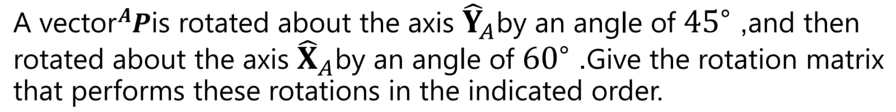

The first step to solve this problem is to get the matrixes of each rotation of the stablished vector, it is important to solve it following the chronological order in which the problem states the rotations happened, in this case, first the rotation about the Y axis and then the rotation about the X axis.

-**How can rotation be visualized?**  
To better visualize rotational transformations, it is helpful to represent the vector within a Cartesian coordinate system. A rotation about a given axis leaves the component aligned with that axis unchanged, while the remaining components are transformed. For example, a rotation about the Y-axis affects only the X and Z components of the vector, as the rotation takes place in the plane perpendicular to the Y-axis. This behavior is reflected in the corresponding rotation matrix, where the Y component remains constant.

In the images below, in the drawn cartesian planes, it can be observed the original position vectors, represented by **X_1 and Y_1**, as well as the positions of said vectors after the rotation, represented by **X_2 and Y_2**. Since the problem also has the angle of rotation in both cases, we can use cos and sin relations to find the new coordinates, resulting in the matrixes of each corresponding rotation.

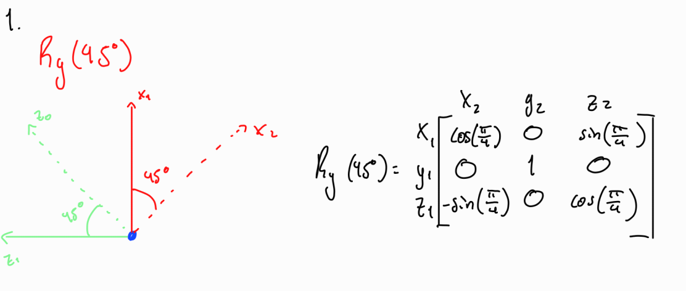

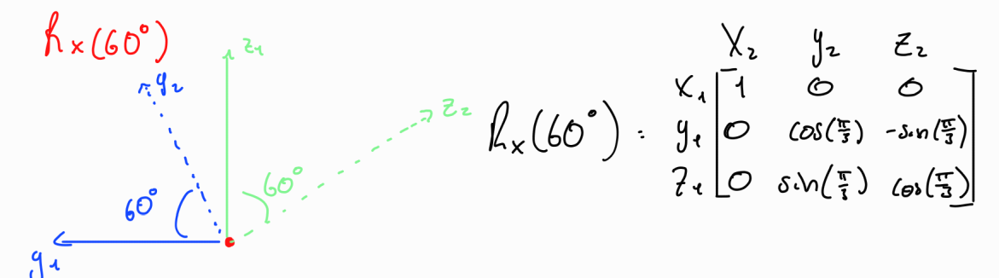

This problem describes a vector experiencing two rotations, so after obtaining the matrix for each rotation we need to multiply said matrixes to obtain the rotation matrix **R** that performs the rotations in the indicated order.
It is important to remember that matrix multiplication is not commutative so the order in which they are multiplied matters. In the case of rotation matrixes, we order the multiplication from the latest matrix to the first one, as we can see in the following image:

In order to multiply two matrices, the number of columns of the first matrix must be equal to the number of rows of the second matrix. Each element of the resulting matrix is obtained by taking the dot product of a row from the first matrix with a column from the second matrix.

Finally we just need to simplify our result and we get the rotation matrix **R** whit all its axis components:

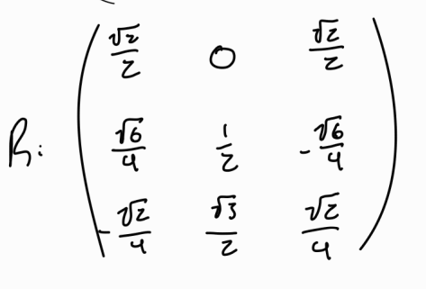
---

## 2) Second problem
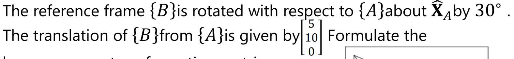

In this problem it can be observed that the reference frame experiences two different kinds of movement, a rotation and then translation. Same as the last problem, the movement of the reference frame must be analyzed in order the problem to present them, in this case, first the rotation of the reference frame B with respect to the reference frame A, then the translation form B to A.

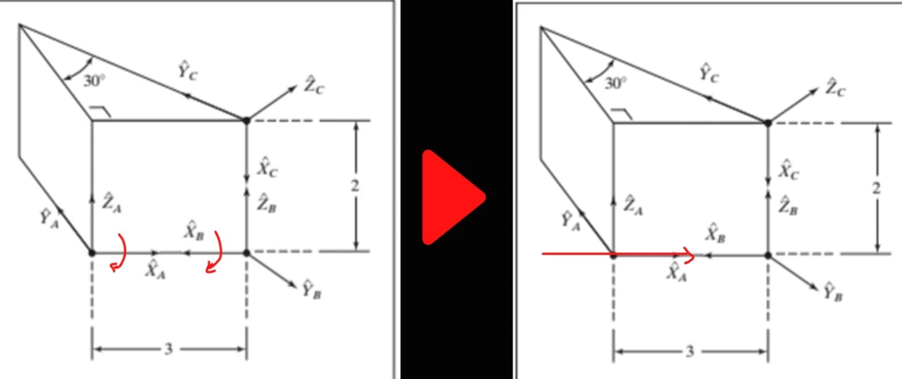

For the rotation of reference frame B the problem is asking to make said rotation with respect to reference frame A about X_A by 30. This means that we are going to use the right-hand rule in A in order to follow that movement when B is rotated. Like so:

Notice that since the problem asks to make the rotation with respect to reference frame A about X_A, in the perspective of reference frame B the rotation is negative as such, the rotation angle in the view point of reference frame B is -30 degrees.  
By making the visualization of the rotation in reference frame B, its matrix can be calculated:

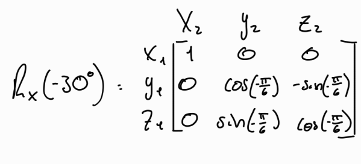

The next step would be to calculate the translation of B from A but in this case the problem already establishes it, but since its a 3D space the point is represented as such:

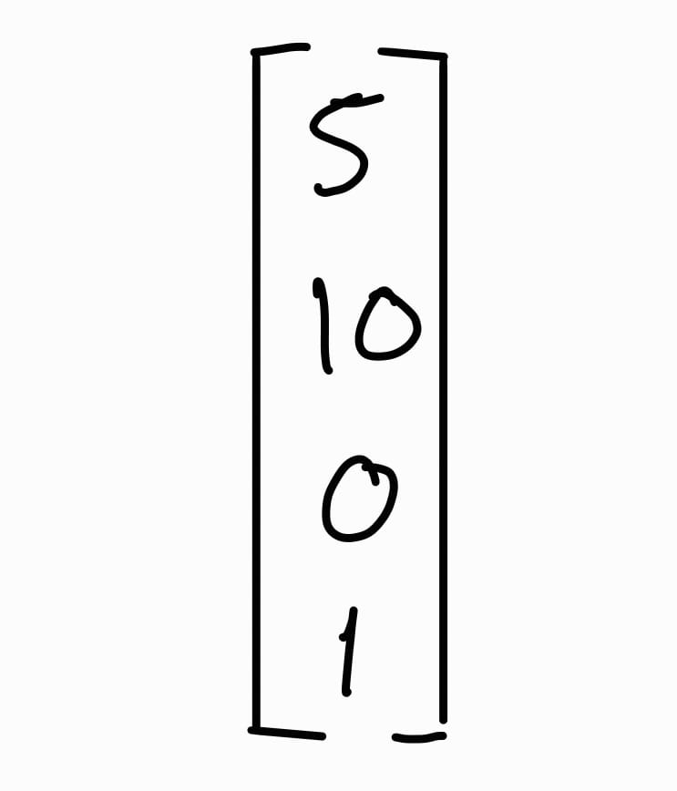

Now the problem is asking the formulation of a homogeneous transform matrix. Which is the combination of both rotation and translation in a single transformation. This results in a 4x4 matrix containing the matrix of the rotation and the translation vector. For this particular problem it looks like this:

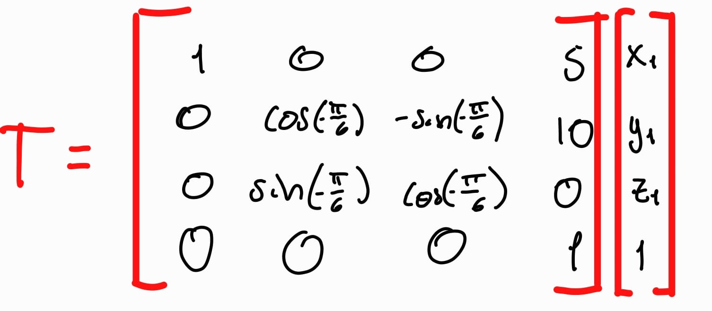
---

## 3)Third problem
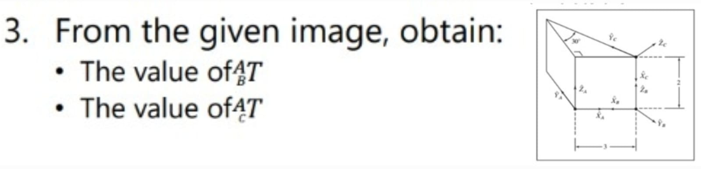

This problem is asking for the homogeneouus transformation matrix from reference frame A to reference frame B, as well as the transformation matrix from reference frame A to reference frame C. So in this case we have to different matrixes that are independent from one another so it each one recures an individual analysis of the movement that composes them.

In my case I decided to star by studying the transformation matrix from reference frame A to reference frame B, keep in mind that it won’t affect the result which one is solved first since they don’t hold any relation to each other.

For the movement from frame A to B it can be concluded by looking at image presented that the first movement of this transformation is a translation. As shown in the following image, the translation from frame A to B is simple as its only translation over the X axis, meaning that the vector would look like this (considering that we are solving a problem in a 3D space):

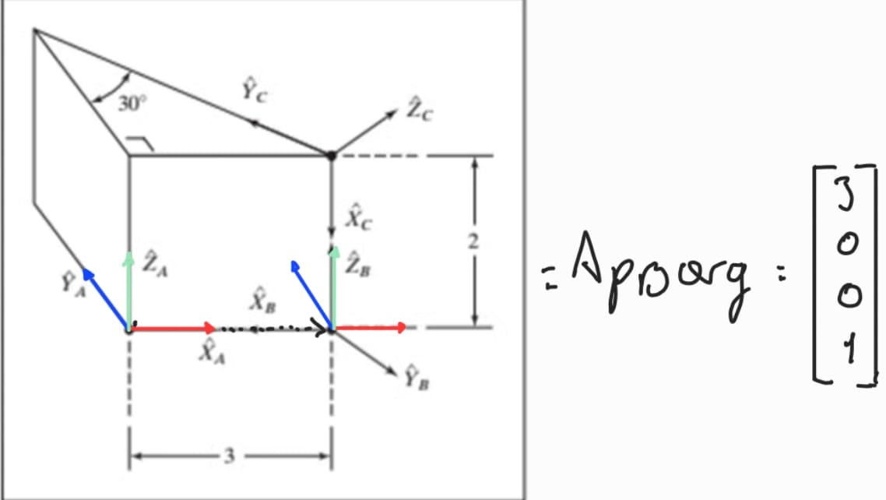

Now the translated frame must be rotated in a way that matches its destination as it’s shown. It can be observed that the translated A frame Y_A and X_A axis are in the opposite direction in comparison to the Y_B and X_A axis. It can be concluded that the rotation is about the Z axes by an angle of 180 degrees:

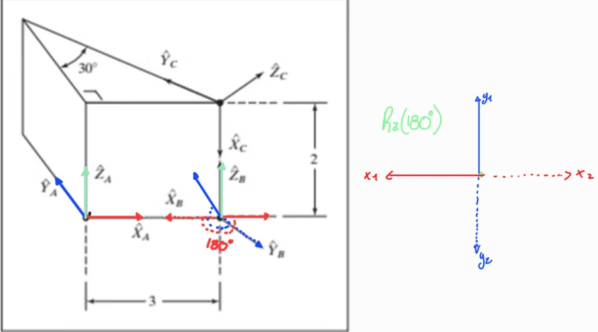

Having the rotation visualized, the rotation matrix can be formulated:

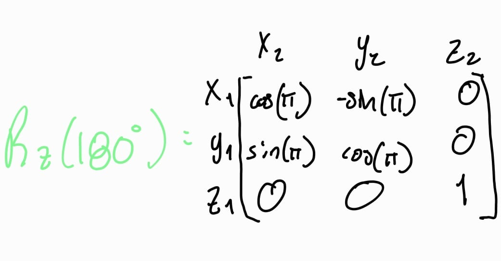

Now all that is left is to obtain the homogeneous transformation matrix by combining both the vector translation and the matrix rotation as we did the last problem:

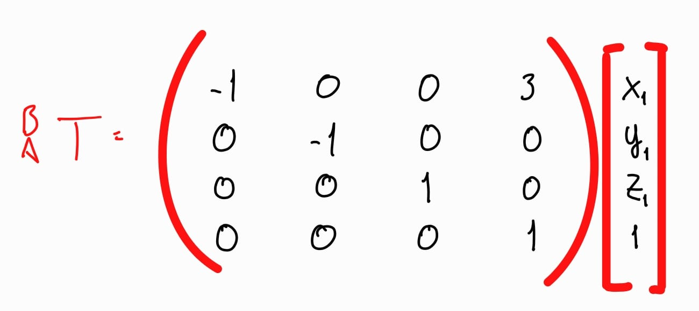

For the homogeneous transformation matrix from A to C we can assume that the first movement was also a translation, this translation is composed of coordinates. X and Z which results in a translator vector:

It now can be observed that to complete the transformation from A to C, we need rotations, and after analyzing the image it can be concluded that the rotations are as follows: one rotation along the Y axis, and another along the X axis. As a side tangent its important to bring up the fact that one the A frame is translated onto the C frame, none of the axis from the A frame are aligned with the C frame, which means that you can start the rotation alongside any axis, that would result in one or more axis from the A frame to coincide with the axis of the C frame, and get to the same point as anyone else that’s doing the same exercise because physically, if the problem is solved correctly, the matrixes product will be equivalent to other products made by other people, and this doesn’t have anything to do with any commutative properties (which matrixes don’t have). It’s more so because by using different axis as reference we create equivalent matrixes.  Basically, it doesn’t matter which rotation anyone choose to start (which in this case there are only 4 possible combinations) as long as the rotations end with the frame A coinciding with the frame C the matrixes will be equivalent.  
In my case I started the rotation alongside the Y axis by 90 degrees:

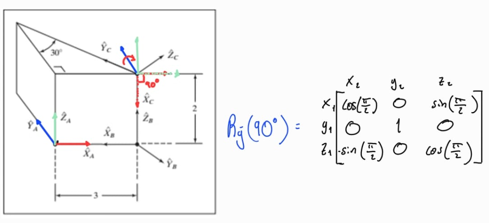

Once we star to visualize and follow the rotation is very easy to understand by which axis it needs to be rotated, in the image above its logical that the next rotation is made along the X axis by -30 degrees.

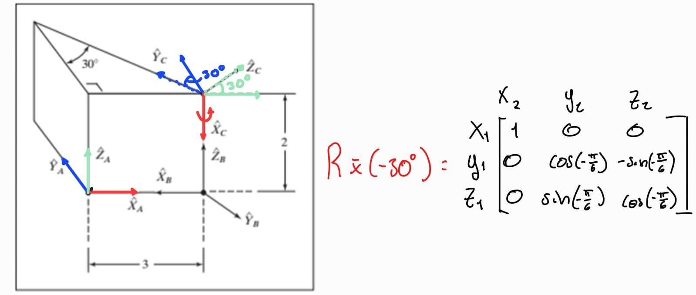

Once we have both matrixes we need to multiply them to now the complete rotation of the AC frame.

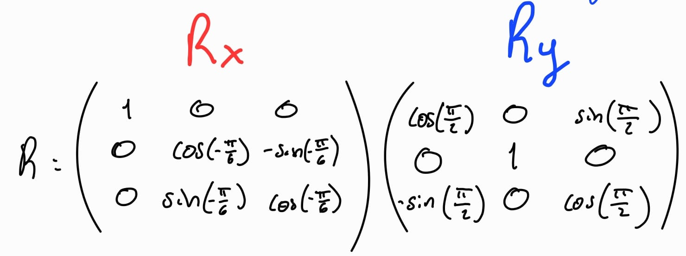

After simplifying the matrix we get this:

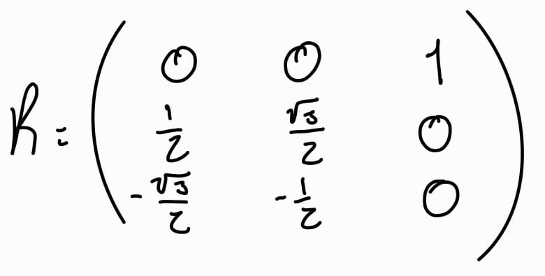

All that is left is to obtain the homogeneous transformation matrix by combining both the vector translations with the frame rotation:

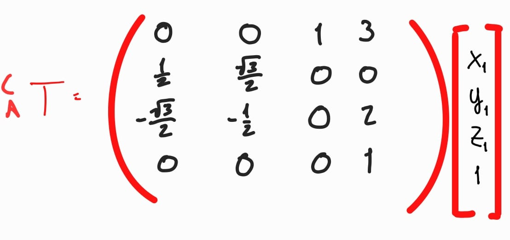
