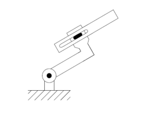
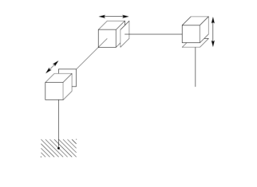
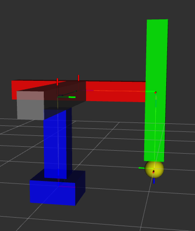
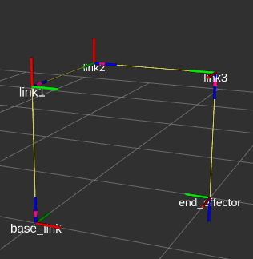
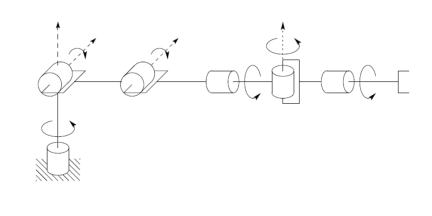
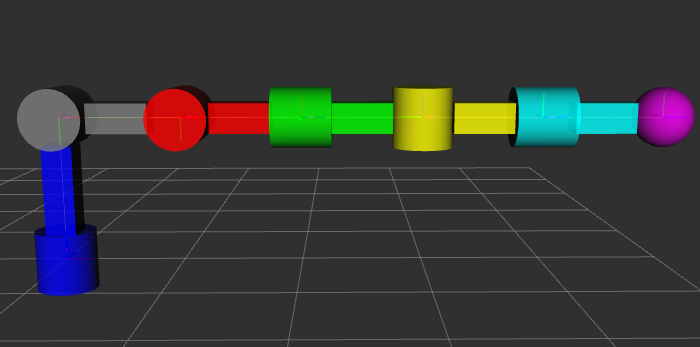
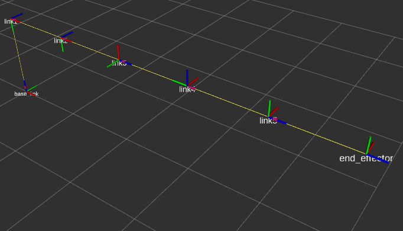
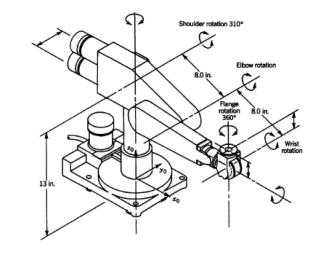
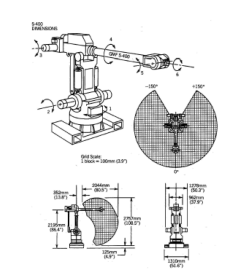
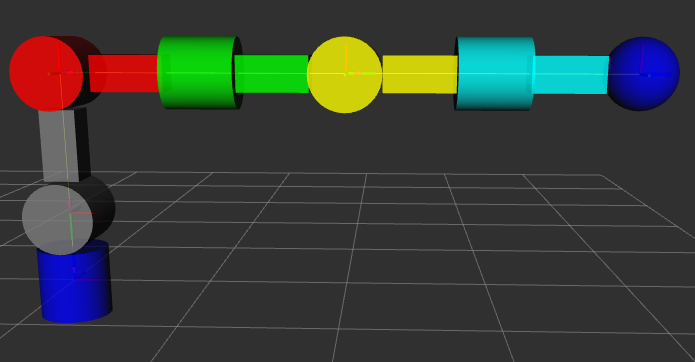

# URDF robots

> Activity: Simulate in RVIZ the basic structure and movement of a series of robots.

---

## 1) First robot


### First step: Materials
Stablish the “materials” or colors to differentiate each link and joint of the robot.

``` code
    <material name="blue">
        <color rgba="0 0 1 1"/>
    </material>
    <material name="gray">
        <color rgba="0.5 0.5 0.5 1"/>
    </material>
    <material name="red">
        <color rgba="1 0 0 1"/>
    </material>
    <material name="green">
        <color rgba="0 1 0 1"/>
    </material>
```

---

### Second step: Links
Create the "links" wich in this case are the visual part of the robot, here you stablish the geometry of the part, if its a rectagle, cylinder, sphere or box, and its dimensions.

``` code
<link name="base_link">
    <visual>
        <geometry>
            <box size="0.5 0.5 0.5"/>
        </geometry>
        <origin xyz="0 0 0" rpy="0 0 0"/>
        <material name="blue"/>
    </visual>
    <visual>
        <geometry>
            <box size="0.25 0.25 0.75"/>
        </geometry>
        <origin xyz="0 0 0.5" rpy="0 0 0"/>
        <material name="blue"/>
    </visual>
</link>

<link name="link1">
    <visual>
        <geometry>
            <cylinder radius="0.125" length="0.5"/>
        </geometry>
        <origin xyz="0 0 0" rpy="0 0 0"/>
        <material name="gray"/>
    </visual>
     <visual>
        <geometry>
            <box size="1 0.25 0.25"/>
        </geometry>
        <origin xyz="0.375 0 0" rpy="0 0 0"/>
        <material name="gray"/>
    </visual>
    <visual>
        <geometry>
            <box size="0.25 -0.5 0.25"/>
        </geometry>
        <origin xyz="1 -0.125 0" rpy="0 0 0"/>
        <material name="gray"/>
    </visual>
</link>

<link name="link2">
    <visual>
        <geometry>
            <cylinder radius="0.125" length="1"/>
        </geometry>
        <origin xyz="0 0 0" rpy="0 0 0"/>
        <material name="red"/>
    </visual>
</link>

<link name="end_effector">
    <visual>
        <geometry>
            <sphere radius="0.125"/>
        </geometry>
        <origin xyz="0 0 0.125" rpy="0 0 0"/>
        <material name="green"/>
    </visual>
</link>
```

---

### Third step: Joints
Stablish the joints, the origin axis for each articulation of the robot, setting distances and angulations between each joint’s axis.

``` code 
<joint name="joint1" type="revolute">
    <origin xyz="0 0 1" rpy="-1.57 0 0"/>
    <parent link="base_link"/>
    <child link="link1"/>
    <axis xyz="0 0 1"/>
    <limit lower="-1.57" upper="1.57" effort="100" velocity="100"/>
</joint>

<joint name="joint2" type="prismatic">
    <origin xyz="1 -0.5 0" rpy="-1.57 0 -1.57"/>
    <parent link="link1"/>
    <child link="link2"/>
    <axis xyz="0 0 1"/>
    <limit lower="-1.57" upper="1.57" effort="100" velocity="100"/>
</joint>

<joint name="joint3" type="fixed">
    <origin xyz="0 0 0.5" rpy="0 0 -1.57"/>
    <parent link="link2"/>
    <child link="end_effector"/>
    <axis xyz="0 0 1"/>
    <limit lower="-1.57" upper="1.57" effort="100" velocity="100"/>
</joint>
```
### Full code:
``` code
<?xml version="1.0"?>

<robot name="my_robot">
    <material name="blue">
        <color rgba="0 0 1 1"/>
    </material>
    <material name="gray">
        <color rgba="0.5 0.5 0.5 1"/>
    </material>
    <material name="red">
        <color rgba="1 0 0 1"/>
    </material>
    <material name="green">
        <color rgba="0 1 0 1"/>
    </material>
<link name="base_link">
    <visual>
        <geometry>
            <box size="0.5 0.5 0.5"/>
        </geometry>
        <origin xyz="0 0 0" rpy="0 0 0"/>
        <material name="blue"/>
    </visual>
    <visual>
        <geometry>
            <box size="0.25 0.25 0.75"/>
        </geometry>
        <origin xyz="0 0 0.5" rpy="0 0 0"/>
        <material name="blue"/>
    </visual>
</link>

<link name="link1">
    <visual>
        <geometry>
            <cylinder radius="0.125" length="0.5"/>
        </geometry>
        <origin xyz="0 0 0" rpy="0 0 0"/>
        <material name="gray"/>
    </visual>
     <visual>
        <geometry>
            <box size="1 0.25 0.25"/>
        </geometry>
        <origin xyz="0.375 0 0" rpy="0 0 0"/>
        <material name="gray"/>
    </visual>
    <visual>
        <geometry>
            <box size="0.25 -0.5 0.25"/>
        </geometry>
        <origin xyz="1 -0.125 0" rpy="0 0 0"/>
        <material name="gray"/>
    </visual>
</link>

<link name="link2">
    <visual>
        <geometry>
            <cylinder radius="0.125" length="1"/>
        </geometry>
        <origin xyz="0 0 0" rpy="0 0 0"/>
        <material name="red"/>
    </visual>
</link>

<link name="end_effector">
    <visual>
        <geometry>
            <sphere radius="0.125"/>
        </geometry>
        <origin xyz="0 0 0.125" rpy="0 0 0"/>
        <material name="green"/>
    </visual>
</link>

<joint name="joint1" type="revolute">
    <origin xyz="0 0 1" rpy="-1.57 0 0"/>
    <parent link="base_link"/>
    <child link="link1"/>
    <axis xyz="0 0 1"/>
    <limit lower="-1.57" upper="1.57" effort="100" velocity="100"/>
</joint>

<joint name="joint2" type="prismatic">
    <origin xyz="1 -0.5 0" rpy="-1.57 0 -1.57"/>
    <parent link="link1"/>
    <child link="link2"/>
    <axis xyz="0 0 1"/>
    <limit lower="-1.57" upper="1.57" effort="100" velocity="100"/>
</joint>

<joint name="joint3" type="fixed">
    <origin xyz="0 0 0.5" rpy="0 0 -1.57"/>
    <parent link="link2"/>
    <child link="end_effector"/>
    <axis xyz="0 0 1"/>
    <limit lower="-1.57" upper="1.57" effort="100" velocity="100"/>
</joint>
</robot>
```

### Robot simulation
In order to run the simulation of the code above, we need to enter the followig command on the Ubuntu terminal.

``` code
ros2 launch urdf_tutorial display.launch.py model:=$HOME/your_ws/src/your_package/your_robot.urdf
```

In my case:  

``` code
ros2 launch urdf_tutorial display.launch.py model:=$HOME/hector_ws/src/hecrobot_descrip/exercise1.urdf
```

**Robot simulation**  


**Robot axis positions**  


---

## 2) Second Robot


### First step: Materials
Stablish the “materials” or colors to differentiate each link and joint of the robot.

``` code
    <material name="blue">
        <color rgba="0 0 1 1"/>
    </material>
    <material name="gray">
        <color rgba="0.5 0.5 0.5 1"/>
    </material>
    <material name="red">
        <color rgba="1 0 0 1"/>
    </material>
    <material name="green">
        <color rgba="0 1 0 1"/>
    </material>
    <material name="yellow">
        <color rgba="1 1 0 1"/>
    </material>
```

---

### Second step: Links
Create the "links" wich in this case are the visual part of the robot, here you stablish the geometry of the part, if its a rectagle, cylinder, sphere or box, and its dimensions.

``` code
<link name="base_link">
    <visual>
        <geometry>
            <box size="0.5 0.5 0.25"/>
        </geometry>
        <origin xyz="0 0 0" rpy="0 0 0"/>
        <material name="blue"/>
    </visual>
    <visual>
        <geometry>
            <box size="0.25 0.25 0.75"/>
        </geometry>
        <origin xyz="0 0 0.5" rpy="0 0 0"/>
        <material name="blue"/>
    </visual>
</link>

<link name="link1">
    <visual>
        <geometry>
            <box size="0.25 0.25 1.75"/>
        </geometry>
        <origin xyz="0 0 0" rpy="0 0 0"/>
        <material name="gray"/>
    </visual>
</link>

<link name="link2">
    <visual>
        <geometry>
            <box size="0.25 0.25 1.75"/>
        </geometry>
        <origin xyz="0 0 0" rpy="0 0 0"/>
        <material name="red"/>
    </visual>
</link>

<link name="link3">
    <visual>
        <geometry>
            <box size="0.25 0.25 1.75"/>
        </geometry>
        <origin xyz="0 0 0" rpy="0 0 0"/>
        <material name="green"/>
    </visual>
</link>

<link name="end_effector">
    <visual>
        <geometry>
            <sphere radius="0.125"/>
        </geometry>
        <origin xyz="0 0 0" rpy="0 0 0"/>
        <material name="yellow"/>
    </visual>
</link>
```

---

### Third step: Joints
Stablish the joints, the origin axis for each articulation of the robot, setting distances and angulations between each joint’s axis.

``` code 
<joint name="joint1" type="prismatic">
    <parent link="base_link"/>
    <child link="link1"/>
    <origin xyz="0 0 1" rpy="-1.57 -1.57 0"/>
    <axis xyz="0 0 1"/>
    <limit lower="-1.57" upper="1.57" effort="10" velocity="1"/>
</joint>

<joint name="joint2" type="prismatic">
    <parent link="link1"/>
    <child link="link2"/>
    <origin xyz="0 0 1" rpy="-1.57 0 0"/>
    <axis xyz="0 0 1"/>
    <limit lower="-1.57" upper="1.57" effort="10" velocity="1"/>
</joint>

<joint name="joint3" type="prismatic">
    <parent link="link2"/>
    <child link="link3"/>
    <origin xyz="0 0 1" rpy="-1.57 0 1.57"/>
    <axis xyz="0 0 1"/>
    <limit lower="-1.57" upper="1.57" effort="10" velocity="1"/>
</joint>

<joint name="joint4" type="fixed">
    <parent link="link3"/>
    <child link="end_effector"/>
    <origin xyz="0 0 1" rpy="0 0 0"/>
    <axis xyz="0 0 1"/>
    <limit lower="-1.57" upper="1.57" effort="10" velocity="1"/>
</joint>
```
### Full code:
``` code
<?xml version="1.0"?>

<robot name="my_robot" >
    <material name="blue">
        <color rgba="0 0 1 1"/>
    </material>
    <material name="gray">
        <color rgba="0.5 0.5 0.5 1"/>
    </material>
    <material name="red">
        <color rgba="1 0 0 1"/>
    </material>
    <material name="green">
        <color rgba="0 1 0 1"/>
    </material>
    <material name="yellow">
        <color rgba="1 1 0 1"/>
    </material>

<link name="base_link">
    <visual>
        <geometry>
            <box size="0.5 0.5 0.25"/>
        </geometry>
        <origin xyz="0 0 0" rpy="0 0 0"/>
        <material name="blue"/>
    </visual>
    <visual>
        <geometry>
            <box size="0.25 0.25 0.75"/>
        </geometry>
        <origin xyz="0 0 0.5" rpy="0 0 0"/>
        <material name="blue"/>
    </visual>
</link>

<link name="link1">
    <visual>
        <geometry>
            <box size="0.25 0.25 1.75"/>
        </geometry>
        <origin xyz="0 0 0" rpy="0 0 0"/>
        <material name="gray"/>
    </visual>
</link>

<link name="link2">
    <visual>
        <geometry>
            <box size="0.25 0.25 1.75"/>
        </geometry>
        <origin xyz="0 0 0" rpy="0 0 0"/>
        <material name="red"/>
    </visual>
</link>

<link name="link3">
    <visual>
        <geometry>
            <box size="0.25 0.25 1.75"/>
        </geometry>
        <origin xyz="0 0 0" rpy="0 0 0"/>
        <material name="green"/>
    </visual>
</link>

<link name="end_effector">
    <visual>
        <geometry>
            <sphere radius="0.125"/>
        </geometry>
        <origin xyz="0 0 0" rpy="0 0 0"/>
        <material name="yellow"/>
    </visual>
</link>

<joint name="joint1" type="prismatic">
    <parent link="base_link"/>
    <child link="link1"/>
    <origin xyz="0 0 1" rpy="-1.57 -1.57 0"/>
    <axis xyz="0 0 1"/>
    <limit lower="-1.57" upper="1.57" effort="10" velocity="1"/>
</joint>

<joint name="joint2" type="prismatic">
    <parent link="link1"/>
    <child link="link2"/>
    <origin xyz="0 0 1" rpy="-1.57 0 0"/>
    <axis xyz="0 0 1"/>
    <limit lower="-1.57" upper="1.57" effort="10" velocity="1"/>
</joint>

<joint name="joint3" type="prismatic">
    <parent link="link2"/>
    <child link="link3"/>
    <origin xyz="0 0 1" rpy="-1.57 0 1.57"/>
    <axis xyz="0 0 1"/>
    <limit lower="-1.57" upper="1.57" effort="10" velocity="1"/>
</joint>

<joint name="joint4" type="fixed">
    <parent link="link3"/>
    <child link="end_effector"/>
    <origin xyz="0 0 1" rpy="0 0 0"/>
    <axis xyz="0 0 1"/>
    <limit lower="-1.57" upper="1.57" effort="10" velocity="1"/>
</joint>
</robot>
```

### Robot simulation
In order to run the simulation of the code above, we need to enter the followig command on the Ubuntu terminal.

``` code
ros2 launch urdf_tutorial display.launch.py model:=$HOME/your_ws/src/your_package/your_robot.urdf
```

In my case:  

``` code
ros2 launch urdf_tutorial display.launch.py model:=$HOME/hector_ws/src/hecrobot_descrip/exercise2.urdf
```

**Robot simulation**  


**Robot axis positions**  


---

## 3) Third Robot


### First step: Materials
Stablish the “materials” or colors to differentiate each link and joint of the robot.

``` code
    <material name="blue">
        <color rgba="0 0 1 1"/>
    </material>
    <material name="gray">
        <color rgba="0.5 0.5 0.5 1"/>
    </material>
    <material name="red">
        <color rgba="1 0 0 1"/>
    </material>
    <material name="green">
        <color rgba="0 1 0 1"/>
    </material>
    <material name="yellow">
        <color rgba="1 1 0 1"/>
    </material>
    <material name="cyan">
        <color rgba="0 1 1 1"/>
    </material>
    <material name="magenta">
        <color rgba="1 0 1 1"/>
    </material>
```

---

### Second step: Links
Create the "links" wich in this case are the visual part of the robot, here you stablish the geometry of the part, if its a rectagle, cylinder, sphere or box, and its dimensions.

``` code
<link name="base_link">
    <visual>
        <geometry>
            <cylinder radius="0.25" length="0.5"/>
        </geometry>
        <origin xyz="0 0 0" rpy="0 0 0"/>
        <material name="blue"/>
    </visual>
    <visual>
        <geometry>
            <box size="0.25 0.25 0.75"/>
        </geometry>
        <origin xyz="0 0 0.6" rpy="0 0 0"/>
        <material name="blue"/>
    </visual>
</link>


<link name="link1">
    <visual>
        <geometry>
            <cylinder radius="0.25" length="0.5"/>
        </geometry>
        <origin xyz="0 0 0" rpy="0 0 0"/>
        <material name="gray"/>
    </visual>
    <visual>
        <geometry>
            <box size="0.5 0.25 0.25"/>
        </geometry>
        <origin xyz="0.5 0 0" rpy="0 0 0"/>
        <material name="gray"/>
    </visual>
</link>

<link name="link2">
    <visual>
        <geometry>
            <cylinder radius="0.25" length="0.5"/>
        </geometry>
        <origin xyz="0 0 0" rpy="0 0 0"/>
        <material name="red"/>
    </visual>
    <visual>
        <geometry>
            <box size="0.5 0.25 0.25"/>
        </geometry>
        <origin xyz="0.5 0 0" rpy="0 0 0"/>
        <material name="red"/>
    </visual>
</link>

<link name="link3">
    <visual>
        <geometry>
            <cylinder radius="0.25" length="0.5"/>
        </geometry>
        <origin xyz="0 0 0" rpy="0 0 0"/>
        <material name="green"/>
    </visual>
    <visual>
        <geometry>
            <box size="0.25 0.25 0.5"/>
        </geometry>
        <origin xyz="0 0 0.5" rpy="0 0 0"/>
        <material name="green"/>
    </visual>
</link>

<link name="link4">
    <visual>
        <geometry>
            <cylinder radius="0.25" length="0.5"/>
        </geometry>
        <origin xyz="0 0 0" rpy="0 0 0"/>
        <material name="yellow"/>
    </visual>
    <visual>
        <geometry>
            <box size="0.25 0.5 0.25"/>
        </geometry>
        <origin xyz="0 -0.5 0" rpy="0 0 0"/>
        <material name="yellow"/>
    </visual>
</link>

<link name="link5">
    <visual>
        <geometry>
            <cylinder radius="0.25" length="0.5"/>
        </geometry>
        <origin xyz="0 0 0" rpy="0 0 0"/>
        <material name="cyan"/>
    </visual>
    <visual>
        <geometry>
            <box size="0.25 0.25 0.5"/>
        </geometry>
        <origin xyz="0 0 0.5" rpy="0 0 0"/>
        <material name="cyan"/>
    </visual>
</link>

<link name="end_effector">
    <visual>
        <geometry>
            <sphere radius="0.25"/>
        </geometry>
        <origin xyz="0 0 0" rpy="0 0 0"/>
        <material name="magenta"/>
    </visual>
</link>
```

---

### Third step: Joints
Stablish the joints, the origin axis for each articulation of the robot, setting distances and angulations between each joint’s axis.

``` code 
<joint name="joint1" type="revolute">
    <origin xyz="0 0 1.2" rpy="-1.57 0 0"/>
    <parent link="base_link"/>
    <child link="link1"/>
    <axis xyz="0 0 1"/>
    <limit lower="-1.57" upper="1.57" effort="100" velocity="100"/>
</joint>

<joint name="joint2" type="revolute">
    <origin xyz="1 0 0" rpy="0 0 0"/>
    <parent link="link1"/>
    <child link="link2"/>
    <axis xyz="0 0 1"/>
    <limit lower="-1.57" upper="1.57" effort="100" velocity="100"/>
</joint>

<joint name="joint3" type="revolute">
    <origin xyz="1 0 0" rpy="-1.57 0 -1.57"/>
    <parent link="link2"/>
    <child link="link3"/>
    <axis xyz="0 0 1"/>
    <limit lower="-1.57" upper="1.57" effort="100" velocity="100"/>
</joint>
<joint name="joint4" type="revolute">
    <origin xyz="0 0 1" rpy="-1.57 0 -1.57"/>
    <parent link="link3"/>
    <child link="link4"/>
    <axis xyz="0 0 1"/>
    <limit lower="-1.57" upper="1.57" effort="100" velocity="100"/>
</joint>
<joint name="joint5" type="revolute">
    <origin xyz="0 -1 0" rpy="1.57 0 0"/>
    <parent link="link4"/>
    <child link="link5"/>
    <axis xyz="0 0 1"/>
    <limit lower="-1.57" upper="1.57" effort="100" velocity="100"/>
</joint>
<joint name="joint6" type="fixed">
    <origin xyz="0 0 1" rpy=" 0 0 0"/>
    <parent link="link5"/>
    <child link="end_effector"/>
    <axis xyz="0 0 1"/>
    <limit lower="-1.57" upper="1.57" effort="100" velocity="100"/>
</joint>
```
### Full code:
``` code
<?xml version="1.0"?>

<robot name="my_robot_3">
    <material name="blue">
        <color rgba="0 0 1 1"/>
    </material>
    <material name="gray">
        <color rgba="0.5 0.5 0.5 1"/>
    </material>
    <material name="red">
        <color rgba="1 0 0 1"/>
    </material>
    <material name="green">
        <color rgba="0 1 0 1"/>
    </material>
    <material name="yellow">
        <color rgba="1 1 0 1"/>
    </material>
    <material name="cyan">
        <color rgba="0 1 1 1"/>
    </material>
    <material name="magenta">
        <color rgba="1 0 1 1"/>
    </material>

<link name="base_link">
    <visual>
        <geometry>
            <cylinder radius="0.25" length="0.5"/>
        </geometry>
        <origin xyz="0 0 0" rpy="0 0 0"/>
        <material name="blue"/>
    </visual>
    <visual>
        <geometry>
            <box size="0.25 0.25 0.75"/>
        </geometry>
        <origin xyz="0 0 0.6" rpy="0 0 0"/>
        <material name="blue"/>
    </visual>
</link>


<link name="link1">
    <visual>
        <geometry>
            <cylinder radius="0.25" length="0.5"/>
        </geometry>
        <origin xyz="0 0 0" rpy="0 0 0"/>
        <material name="gray"/>
    </visual>
    <visual>
        <geometry>
            <box size="0.5 0.25 0.25"/>
        </geometry>
        <origin xyz="0.5 0 0" rpy="0 0 0"/>
        <material name="gray"/>
    </visual>
</link>

<link name="link2">
    <visual>
        <geometry>
            <cylinder radius="0.25" length="0.5"/>
        </geometry>
        <origin xyz="0 0 0" rpy="0 0 0"/>
        <material name="red"/>
    </visual>
    <visual>
        <geometry>
            <box size="0.5 0.25 0.25"/>
        </geometry>
        <origin xyz="0.5 0 0" rpy="0 0 0"/>
        <material name="red"/>
    </visual>
</link>

<link name="link3">
    <visual>
        <geometry>
            <cylinder radius="0.25" length="0.5"/>
        </geometry>
        <origin xyz="0 0 0" rpy="0 0 0"/>
        <material name="green"/>
    </visual>
    <visual>
        <geometry>
            <box size="0.25 0.25 0.5"/>
        </geometry>
        <origin xyz="0 0 0.5" rpy="0 0 0"/>
        <material name="green"/>
    </visual>
</link>

<link name="link4">
    <visual>
        <geometry>
            <cylinder radius="0.25" length="0.5"/>
        </geometry>
        <origin xyz="0 0 0" rpy="0 0 0"/>
        <material name="yellow"/>
    </visual>
    <visual>
        <geometry>
            <box size="0.25 0.5 0.25"/>
        </geometry>
        <origin xyz="0 -0.5 0" rpy="0 0 0"/>
        <material name="yellow"/>
    </visual>
</link>

<link name="link5">
    <visual>
        <geometry>
            <cylinder radius="0.25" length="0.5"/>
        </geometry>
        <origin xyz="0 0 0" rpy="0 0 0"/>
        <material name="cyan"/>
    </visual>
    <visual>
        <geometry>
            <box size="0.25 0.25 0.5"/>
        </geometry>
        <origin xyz="0 0 0.5" rpy="0 0 0"/>
        <material name="cyan"/>
    </visual>
</link>

<link name="end_effector">
    <visual>
        <geometry>
            <sphere radius="0.25"/>
        </geometry>
        <origin xyz="0 0 0" rpy="0 0 0"/>
        <material name="magenta"/>
    </visual>
</link>

<joint name="joint1" type="revolute">
    <origin xyz="0 0 1.2" rpy="-1.57 0 0"/>
    <parent link="base_link"/>
    <child link="link1"/>
    <axis xyz="0 0 1"/>
    <limit lower="-1.57" upper="1.57" effort="100" velocity="100"/>
</joint>

<joint name="joint2" type="revolute">
    <origin xyz="1 0 0" rpy="0 0 0"/>
    <parent link="link1"/>
    <child link="link2"/>
    <axis xyz="0 0 1"/>
    <limit lower="-1.57" upper="1.57" effort="100" velocity="100"/>
</joint>

<joint name="joint3" type="revolute">
    <origin xyz="1 0 0" rpy="-1.57 0 -1.57"/>
    <parent link="link2"/>
    <child link="link3"/>
    <axis xyz="0 0 1"/>
    <limit lower="-1.57" upper="1.57" effort="100" velocity="100"/>
</joint>
<joint name="joint4" type="revolute">
    <origin xyz="0 0 1" rpy="-1.57 0 -1.57"/>
    <parent link="link3"/>
    <child link="link4"/>
    <axis xyz="0 0 1"/>
    <limit lower="-1.57" upper="1.57" effort="100" velocity="100"/>
</joint>
<joint name="joint5" type="revolute">
    <origin xyz="0 -1 0" rpy="1.57 0 0"/>
    <parent link="link4"/>
    <child link="link5"/>
    <axis xyz="0 0 1"/>
    <limit lower="-1.57" upper="1.57" effort="100" velocity="100"/>
</joint>
<joint name="joint6" type="fixed">
    <origin xyz="0 0 1" rpy=" 0 0 0"/>
    <parent link="link5"/>
    <child link="end_effector"/>
    <axis xyz="0 0 1"/>
    <limit lower="-1.57" upper="1.57" effort="100" velocity="100"/>
</joint>
</robot>
```

### Robot simulation
In order to run the simulation of the code above, we need to enter the followig command on the Ubuntu terminal.

``` code
ros2 launch urdf_tutorial display.launch.py model:=$HOME/your_ws/src/your_package/your_robot.urdf
```

In my case:  

``` code
ros2 launch urdf_tutorial display.launch.py model:=$HOME/hector_ws/src/hecrobot_descrip/exercise3.urdf
```

**Robot simulation**  


**Robot axis positions**  


---

## 4) Fourth Robot


### First step: Materials
Stablish the “materials” or colors to differentiate each link and joint of the robot.

``` code
   <material name="blue">
        <color rgba="0 0 1 1"/>
    </material>
    <material name="gray">
        <color rgba="0.5 0.5 0.5 1"/>
    </material>
    <material name="red">
        <color rgba="1 0 0 1"/>
    </material>
    <material name="green">
        <color rgba="0 1 0 1"/>
    </material>
    <material name="yellow">
        <color rgba="1 1 0 1"/>
    </material>
    <material name="cyan">
        <color rgba="0 1 1 1"/>
    </material>
    <material name="magenta">
        <color rgba="1 0 1 1"/>
    </material>
```

---

### Second step: Links
Create the "links" wich in this case are the visual part of the robot, here you stablish the geometry of the part, if its a rectagle, cylinder, sphere or box, and its dimensions.

``` code
<link name="base_link">
    <visual>
        <geometry>
            <cylinder radius="0.25" length="0.5"/>
        </geometry>
        <origin xyz="0 0 0" rpy="0 0 0"/>
        <material name="blue"/>
    </visual>
</link>

<link name="link1">
    <visual>
        <geometry>
            <cylinder radius="0.25" length="0.5"/>
        </geometry>
        <origin xyz="0 0 0" rpy="0 0 0"/>
        <material name="gray"/>
    </visual>
</link>

<link name="link2">
    <visual>
        <geometry>
            <cylinder radius="0.25" length="0.5"/>
        </geometry>
        <origin xyz="0 0 0" rpy="0 0 0"/>
        <material name="red"/>
    </visual>
</link>

<link name="link3">
    <visual>
        <geometry>
            <cylinder radius="0.25" length="0.5"/>
        </geometry>
        <origin xyz="0 0 0" rpy="0 0 0"/>
        <material name="green"/>
    </visual>
</link>

<link name="link4">
    <visual>
        <geometry>
            <cylinder radius="0.25" length="0.5"/>
        </geometry>
        <origin xyz="0 0 0" rpy="0 0 0"/>
        <material name="yellow"/>
    </visual>
</link>

<link name="link5">
    <visual>
        <geometry>
            <cylinder radius="0.25" length="0.5"/>
        </geometry>
        <origin xyz="0 0 0" rpy="0 0 0"/>
        <material name="cyan"/>
    </visual>
</link>

<link name="end_effector">
    <visual>
        <geometry>
            <cylinder radius="0.25" length="0.125"/>
        </geometry>
        <origin xyz="0 0 0" rpy="0 0 0"/>
        <material name="magenta"/>
    </visual>
</link>
```

---

### Third step: Joints
Stablish the joints, the origin axis for each articulation of the robot, setting distances and angulations between each joint’s axis.

``` code 
<joint name="joint1" type="revolute">
    <parent link="base_link"/>
    <child link="link1"/>
    <origin xyz="0 0 1" rpy="-1.57 0 0"/>
    <axis xyz="0 1 0"/>
    <limit lower="-1.57" upper="1.57" effort="10" velocity="1"/>
</joint>

<joint name="joint2" type="revolute">
    <parent link="link1"/>
    <child link="link2"/>
    <origin xyz="1 0 0" rpy="0 0 0"/>
    <axis xyz="0 1 0"/>
    <limit lower="-1.57" upper="1.57" effort="10" velocity="1"/>
</joint>

<joint name="joint3" type="revolute">
    <parent link="link2"/>
    <child link="link3"/>
    <origin xyz="0 0 -1" rpy="-1.57 0 -1.57"/>
    <axis xyz="0 1 0"/>
    <limit lower="-1.57" upper="1.57" effort="10" velocity="1"/>
</joint>

<joint name="joint4" type="revolute">
    <parent link="link3"/>
    <child link="link4"/>
    <origin xyz="0 0 2.5" rpy="1.57 0 0"/>
    <axis xyz="0 1 0"/>
    <limit lower="-1.57" upper="1.57" effort="10" velocity="1"/>
</joint>

<joint name="joint5" type="revolute">
    <parent link="link4"/>
    <child link="link5"/>
    <origin xyz="0 0 0" rpy="-1.57 0 0"/>
    <axis xyz="0 1 0"/>
    <limit lower="-1.57" upper="1.57" effort="10" velocity="1"/>
</joint>

<joint name="joint6" type="fixed">
    <parent link="link5"/>
    <child link="end_effector"/>
    <origin xyz="0 0 0.1875" rpy="0 0 0"/>
    <axis xyz="0 1 0"/>
    <limit lower="-1.57" upper="1.57" effort="10" velocity="1"/>
</joint>
```
### Full code:
``` code
<?xml version = "1.0"?>

<robot name = "my_robot">
    <material name="blue">
        <color rgba="0 0 1 1"/>
    </material>
    <material name="gray">
        <color rgba="0.5 0.5 0.5 1"/>
    </material>
    <material name="red">
        <color rgba="1 0 0 1"/>
    </material>
    <material name="green">
        <color rgba="0 1 0 1"/>
    </material>
    <material name="yellow">
        <color rgba="1 1 0 1"/>
    </material>
    <material name="cyan">
        <color rgba="0 1 1 1"/>
    </material>
    <material name="magenta">
        <color rgba="1 0 1 1"/>
    </material>

<link name="base_link">
    <visual>
        <geometry>
            <cylinder radius="0.25" length="0.5"/>
        </geometry>
        <origin xyz="0 0 0" rpy="0 0 0"/>
        <material name="blue"/>
    </visual>
</link>

<link name="link1">
    <visual>
        <geometry>
            <cylinder radius="0.25" length="0.5"/>
        </geometry>
        <origin xyz="0 0 0" rpy="0 0 0"/>
        <material name="gray"/>
    </visual>
</link>

<link name="link2">
    <visual>
        <geometry>
            <cylinder radius="0.25" length="0.5"/>
        </geometry>
        <origin xyz="0 0 0" rpy="0 0 0"/>
        <material name="red"/>
    </visual>
</link>

<link name="link3">
    <visual>
        <geometry>
            <cylinder radius="0.25" length="0.5"/>
        </geometry>
        <origin xyz="0 0 0" rpy="0 0 0"/>
        <material name="green"/>
    </visual>
</link>

<link name="link4">
    <visual>
        <geometry>
            <cylinder radius="0.25" length="0.5"/>
        </geometry>
        <origin xyz="0 0 0" rpy="0 0 0"/>
        <material name="yellow"/>
    </visual>
</link>

<link name="link5">
    <visual>
        <geometry>
            <cylinder radius="0.25" length="0.5"/>
        </geometry>
        <origin xyz="0 0 0" rpy="0 0 0"/>
        <material name="cyan"/>
    </visual>
</link>

<link name="end_effector">
    <visual>
        <geometry>
            <cylinder radius="0.25" length="0.125"/>
        </geometry>
        <origin xyz="0 0 0" rpy="0 0 0"/>
        <material name="magenta"/>
    </visual>
</link>

<joint name="joint1" type="revolute">
    <parent link="base_link"/>
    <child link="link1"/>
    <origin xyz="0 0 1" rpy="-1.57 0 0"/>
    <axis xyz="0 1 0"/>
    <limit lower="-1.57" upper="1.57" effort="10" velocity="1"/>
</joint>

<joint name="joint2" type="revolute">
    <parent link="link1"/>
    <child link="link2"/>
    <origin xyz="1 0 0" rpy="0 0 0"/>
    <axis xyz="0 1 0"/>
    <limit lower="-1.57" upper="1.57" effort="10" velocity="1"/>
</joint>

<joint name="joint3" type="revolute">
    <parent link="link2"/>
    <child link="link3"/>
    <origin xyz="0 0 -1" rpy="-1.57 0 -1.57"/>
    <axis xyz="0 1 0"/>
    <limit lower="-1.57" upper="1.57" effort="10" velocity="1"/>
</joint>

<joint name="joint4" type="revolute">
    <parent link="link3"/>
    <child link="link4"/>
    <origin xyz="0 0 2.5" rpy="1.57 0 0"/>
    <axis xyz="0 1 0"/>
    <limit lower="-1.57" upper="1.57" effort="10" velocity="1"/>
</joint>

<joint name="joint5" type="revolute">
    <parent link="link4"/>
    <child link="link5"/>
    <origin xyz="0 0 0" rpy="-1.57 0 0"/>
    <axis xyz="0 1 0"/>
    <limit lower="-1.57" upper="1.57" effort="10" velocity="1"/>
</joint>

<joint name="joint6" type="fixed">
    <parent link="link5"/>
    <child link="end_effector"/>
    <origin xyz="0 0 0.1875" rpy="0 0 0"/>
    <axis xyz="0 1 0"/>
    <limit lower="-1.57" upper="1.57" effort="10" velocity="1"/>
</joint>
</robot>
```

### Robot simulation
In order to run the simulation of the code above, we need to enter the followig command on the Ubuntu terminal.

``` code
ros2 launch urdf_tutorial display.launch.py model:=$HOME/your_ws/src/your_package/your_robot.urdf
```

In my case:  

``` code
ros2 launch urdf_tutorial display.launch.py model:=$HOME/hector_ws/src/hecrobot_descrip/exercise4.urdf
```

**Robot simulation**  


**Robot axis positions**  


---

## 5) Fifth Robot


### First step: Materials
Stablish the “materials” or colors to differentiate each link and joint of the robot.

``` code
   <material name="blue">
        <color rgba="0 0 1 1"/>
    </material>
    <material name="gray">
        <color rgba="0.5 0.5 0.5 1"/>
    </material>
    <material name="red">
        <color rgba="1 0 0 1"/>
    </material>
    <material name="green">
        <color rgba="0 1 0 1"/>
    </material>
    <material name="yellow">
        <color rgba="1 1 0 1"/>
    </material>
    <material name="cyan">
        <color rgba="0 1 1 1"/>
    </material>
```

---

### Second step: Links
Create the "links" wich in this case are the visual part of the robot, here you stablish the geometry of the part, if its a rectagle, cylinder, sphere or box, and its dimensions.

``` code
    <link name="base_link">
        <visual>
            <geometry>
                <cylinder radius="0.25" length="0.5"/>
            </geometry>
            <origin xyz="0 0 0" rpy="0 0 0"/>
            <material name="blue"/>
        </visual>
    </link>

    <link name="link1">
        <visual>
            <geometry>
                <cylinder radius="0.25" length="0.5"/>
            </geometry>
            <origin xyz="0 0 0" rpy="0 0 0"/>
            <material name="gray"/>
        </visual>
        <visual>
            <geometry>
                <box size="0.25 0.5 0.25"/>
            </geometry>
            <origin xyz="0 -0.5 0" rpy="0 0 0"/>
            <material name="gray"/>
        </visual>
    </link>

    <link name="link2">
        <visual>
            <geometry>
                <cylinder radius="0.25" length="0.5"/>
            </geometry>
            <origin xyz="0 0 0" rpy="0 0 0"/>
            <material name="red"/>
        </visual>
        <visual>
            <geometry>
                <box size="0.25 0.5 0.25"/>
            </geometry>
            <origin xyz="0 0.5 0" rpy="0 0 0"/>
            <material name="red"/>
        </visual>
    </link>

    <link name="link3">
        <visual>
            <geometry>
                <cylinder radius="0.25" length="0.5"/>
            </geometry>
            <origin xyz="0 0 1" rpy="0 0 0"/>
            <material name="green"/>
        </visual>
        <visual>
            <geometry>
                <box size="0.25 0.25 0.5"/>
            </geometry>
            <origin xyz="0 0 1.5" rpy="0 0 0"/>
            <material name="green"/>
        </visual>
    </link>

    <link name="link4">
        <visual>
            <geometry>
                <cylinder radius="0.25" length="0.5"/>
            </geometry>
            <origin xyz="0 0 0" rpy="0 0 0"/>
            <material name="yellow"/>
        </visual>
        <visual>
            <geometry>
                <box size="0.25 0.5 0.25"/>
            </geometry>
            <origin xyz="0 0.5 0" rpy="0 0 0"/>
            <material name="yellow"/>
        </visual>
    </link>

    <link name="link5">
        <visual>
            <geometry>
                <cylinder radius="0.25" length="0.5"/>
            </geometry>
            <origin xyz="0 0 1" rpy="0 0 0"/>
            <material name="cyan"/>
        </visual>
        <visual>
            <geometry>
                <box size="0.25 0.25 0.5"/>
            </geometry>
            <origin xyz="0 0 1.5" rpy="0 0 0"/>
            <material name="cyan"/>
        </visual>
    </link>

    <link name="end_effector">
        <visual>
            <geometry>
                <sphere radius="0.25"/>
            </geometry>
            <origin xyz="0 0 0" rpy="0 0 0"/>
            <material name="blue"/>
        </visual>
    </link>
```

---

### Third step: Joints
Stablish the joints, the origin axis for each articulation of the robot, setting distances and angulations between each joint’s axis.

``` code 
    <joint name="joint1" type="revolute">
        <origin xyz="0 0 0.5" rpy="-1.57 0 0"/>
        <parent link="base_link"/>
        <child link="link1"/>
        <axis xyz="0 0 1"/>
        <limit lower="-1.57" upper="1.57" effort="100" velocity="100"/>
    </joint>

    <joint name="joint2" type="revolute">
        <origin xyz="0 -1 0" rpy="0 0 -1.57"/>
        <parent link="link1"/>
        <child link="link2"/>
        <axis xyz="0 0 1"/>
        <limit lower="-1.57" upper="1.57" effort="100" velocity="100"/>
    </joint>

    <joint name="joint3" type="revolute">
        <origin xyz="0 0 0" rpy="-1.57 0 0"/>
        <parent link="link2"/>
        <child link="link3"/>
        <axis xyz="0 0 1"/>
        <limit lower="-1.57" upper="1.57" effort="100" velocity="100"/>
    </joint>

    <joint name="joint4" type="revolute">
        <origin xyz="0 0 2" rpy="1.57 0 0"/>
        <parent link="link3"/>
        <child link="link4"/>
        <axis xyz="0 0 1"/>
        <limit lower="-1.57" upper="1.57" effort="100" velocity="100"/>
    </joint>

    <joint name="joint5" type="revolute">
        <origin xyz="0 0 0" rpy="-1.57 0 0"/>
        <parent link="link4"/>
        <child link="link5"/>
        <axis xyz="0 0 1"/>
        <limit lower="-1.57" upper="1.57" effort="100" velocity="100"/>
    </joint>

    <joint name="joint6" type="fixed">
        <origin xyz="0 0 2" rpy="0 0 0"/>
        <parent link="link5"/>
        <child link="end_effector"/>
        <axis xyz="0 0 1"/>
        <limit lower="-1.57" upper="1.57" effort="100" velocity="100"/>
    </joint>
```
### Full code:
``` code
<?xml version="1.0"?>

<robot name="my_robot_5">
    <material name="blue">
        <color rgba="0 0 1 1"/>
    </material>
    <material name="gray">
        <color rgba="0.5 0.5 0.5 1"/>
    </material>
    <material name="red">
        <color rgba="1 0 0 1"/>
    </material>
    <material name="green">
        <color rgba="0 1 0 1"/>
    </material>
    <material name="yellow">
        <color rgba="1 1 0 1"/>
    </material>
    <material name="cyan">
        <color rgba="0 1 1 1"/>
    </material>

    <link name="base_link">
        <visual>
            <geometry>
                <cylinder radius="0.25" length="0.5"/>
            </geometry>
            <origin xyz="0 0 0" rpy="0 0 0"/>
            <material name="blue"/>
        </visual>
    </link>

    <link name="link1">
        <visual>
            <geometry>
                <cylinder radius="0.25" length="0.5"/>
            </geometry>
            <origin xyz="0 0 0" rpy="0 0 0"/>
            <material name="gray"/>
        </visual>
        <visual>
            <geometry>
                <box size="0.25 0.5 0.25"/>
            </geometry>
            <origin xyz="0 -0.5 0" rpy="0 0 0"/>
            <material name="gray"/>
        </visual>
    </link>

    <link name="link2">
        <visual>
            <geometry>
                <cylinder radius="0.25" length="0.5"/>
            </geometry>
            <origin xyz="0 0 0" rpy="0 0 0"/>
            <material name="red"/>
        </visual>
        <visual>
            <geometry>
                <box size="0.25 0.5 0.25"/>
            </geometry>
            <origin xyz="0 0.5 0" rpy="0 0 0"/>
            <material name="red"/>
        </visual>
    </link>

    <link name="link3">
        <visual>
            <geometry>
                <cylinder radius="0.25" length="0.5"/>
            </geometry>
            <origin xyz="0 0 1" rpy="0 0 0"/>
            <material name="green"/>
        </visual>
        <visual>
            <geometry>
                <box size="0.25 0.25 0.5"/>
            </geometry>
            <origin xyz="0 0 1.5" rpy="0 0 0"/>
            <material name="green"/>
        </visual>
    </link>

    <link name="link4">
        <visual>
            <geometry>
                <cylinder radius="0.25" length="0.5"/>
            </geometry>
            <origin xyz="0 0 0" rpy="0 0 0"/>
            <material name="yellow"/>
        </visual>
        <visual>
            <geometry>
                <box size="0.25 0.5 0.25"/>
            </geometry>
            <origin xyz="0 0.5 0" rpy="0 0 0"/>
            <material name="yellow"/>
        </visual>
    </link>

    <link name="link5">
        <visual>
            <geometry>
                <cylinder radius="0.25" length="0.5"/>
            </geometry>
            <origin xyz="0 0 1" rpy="0 0 0"/>
            <material name="cyan"/>
        </visual>
        <visual>
            <geometry>
                <box size="0.25 0.25 0.5"/>
            </geometry>
            <origin xyz="0 0 1.5" rpy="0 0 0"/>
            <material name="cyan"/>
        </visual>
    </link>

    <link name="end_effector">
        <visual>
            <geometry>
                <sphere radius="0.25"/>
            </geometry>
            <origin xyz="0 0 0" rpy="0 0 0"/>
            <material name="blue"/>
        </visual>
    </link>

    <joint name="joint1" type="revolute">
        <origin xyz="0 0 0.5" rpy="-1.57 0 0"/>
        <parent link="base_link"/>
        <child link="link1"/>
        <axis xyz="0 0 1"/>
        <limit lower="-1.57" upper="1.57" effort="100" velocity="100"/>
    </joint>

    <joint name="joint2" type="revolute">
        <origin xyz="0 -1 0" rpy="0 0 -1.57"/>
        <parent link="link1"/>
        <child link="link2"/>
        <axis xyz="0 0 1"/>
        <limit lower="-1.57" upper="1.57" effort="100" velocity="100"/>
    </joint>

    <joint name="joint3" type="revolute">
        <origin xyz="0 0 0" rpy="-1.57 0 0"/>
        <parent link="link2"/>
        <child link="link3"/>
        <axis xyz="0 0 1"/>
        <limit lower="-1.57" upper="1.57" effort="100" velocity="100"/>
    </joint>

    <joint name="joint4" type="revolute">
        <origin xyz="0 0 2" rpy="1.57 0 0"/>
        <parent link="link3"/>
        <child link="link4"/>
        <axis xyz="0 0 1"/>
        <limit lower="-1.57" upper="1.57" effort="100" velocity="100"/>
    </joint>

    <joint name="joint5" type="revolute">
        <origin xyz="0 0 0" rpy="-1.57 0 0"/>
        <parent link="link4"/>
        <child link="link5"/>
        <axis xyz="0 0 1"/>
        <limit lower="-1.57" upper="1.57" effort="100" velocity="100"/>
    </joint>

    <joint name="joint6" type="fixed">
        <origin xyz="0 0 2" rpy="0 0 0"/>
        <parent link="link5"/>
        <child link="end_effector"/>
        <axis xyz="0 0 1"/>
        <limit lower="-1.57" upper="1.57" effort="100" velocity="100"/>
    </joint>
</robot>
```

### Robot simulation
In order to run the simulation of the code above, we need to enter the followig command on the Ubuntu terminal.

``` code
ros2 launch urdf_tutorial display.launch.py model:=$HOME/your_ws/src/your_package/your_robot.urdf
```

In my case:  

``` code
ros2 launch urdf_tutorial display.launch.py model:=$HOME/hector_ws/src/hecrobot_descrip/exercise5.urdf
```

**Robot simulation**  


**Robot axis positions**  


---
